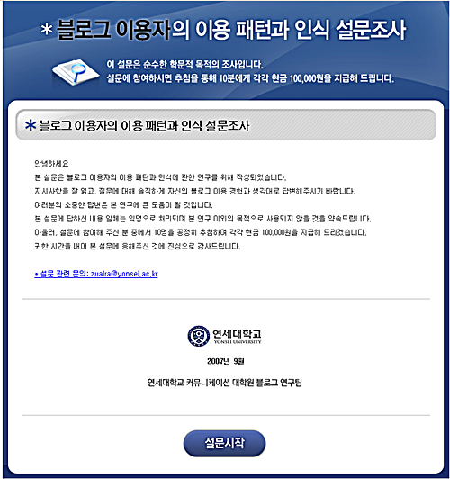

  
올블로그의 배너를 보고 돈 준다는 문구에 혹해서(^^) [**블로그 사용자의 이용 패턴과 인식 설문조사**](http://www.expressme.co.kr/)를 하려고 들어갔는데,  

<!-- truncate -->

  
[**파이어폭스**](http://www.mozilla.or.kr/)에서 [설문시작] 버튼을 클릭하니 다음 페이지로 넘어가지 않는다.  
  
[**오페라**](http://www.opera.com/)에서 [설문시작] 버튼을 클릭하니 다음 페이지로 넘어가지 않는다.  
  
[**사파리**](http://www.apple.com/safari/)에서 [설문시작] 버튼을 클릭하니 다음 페이지로 넘어가지 않는다.  
  
그래서, 안했다; -\_-;  
  
설문조사 1번 문항도 볼 수 없었지만, 일단 한가지 말은 전하고 싶다.  
  

**'저는 블로깅할 때 인터넷 익스플로러를 사용하지 않습니다.'**

  
p.s. 그나저나 블로그 이용자라는 말이 신선하다. 저쪽 학술용어로는 블로거란 말보다 블로그 이용자란 말이 더 자주 사용되나 보다… 라고 생각했다가 꼭 블로그를 갖고 있지 않아도 방문하거나 댓글만 다는 사람들도 포함되나 보다 라고 생각.
