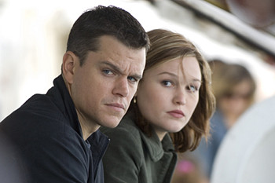

본 시리즈 중에서 가장 매력적인 서브 플롯이라 한다면 바로 1편에서부터 이어진 제이슨 본 (Jason Bourne)과 그의 독일인 연인 마리 크로이츠 (Marie Kreutz)의 이야기일 것입니다. 시리즈의 첫번째 편에서만 겨우 웃는 우리의 안타까운 스파이 제이슨 본에 대한 자세한 이야기는 Jade님의 글, [**제이슨 본의 미소**](http://yoopage.com/262)를 읽어보면 알 수 있죠.  

<!-- truncate -->

그리고, 아마도, 그 뒤를 잇는 서브 플롯이라면 희미하게 드러난 제이슨 본과 니키 파슨스 (Nicky Parsons)의 관계가 아닐까 싶어요.  
  
  

**1**  
  
니키 파슨스는 시리즈의 두 번째 이야기인 <본 슈프리머시> (Bourne Supremacy, 2004)에서 독일 주재 유학생으로 신분을 위장한 채 독일 지역 스파이들을 본부와 연결시켜주는 연락책으로 등장합니다. 그녀는 3편인 <본 얼티메이텀> (Bourne Ultimatum, 2007)에서는 적극적으로 제이슨 본을 돕는 역할을 맡게 되지요.  
  
별다른 이유(설명)없이 본을 적극적으로 돕는 게 좀 뜬금없을 수도 있겠지요.  
  
**2**  
  
본부의 추적을 피하고 닐 다니엘스를 찾기 위한 본격적인 행동을 하기 앞서 둘은 어느 휴게소에 들르는데, 그녀는 본에게 '정말 아무 것도 기억나지 않느냐'며 묻습니다. (You really don't remember anything, do you?) 마치 오래된 연인을 오랜만에 만나 많은 궁금한 점을 지긋이 누르며 쳐다보는 눈빛을 슬쩍 비치며 말이죠.  
  
**3**  
  
그리고, 시리즈의 1편인 <본 아이덴티티> (Bourne Identity, 2002)의 대구 마냥 3편에서는 니키가 (본부의 감시를 피하기 위해) 머리를 자르고 염색을 하는 장면도 나오지요. 하지만, 본은 그녀를 돕지 않고 그저 바라만 봅니다. 마리의 기억이 아직 남아있기 때문이겠지요.  
  
이쯤되면 대충 생략된 이야기가 흐릿하게 나마 보이는 듯 합니다.  
  
**0**  
  
아래의 영상은 두번째 편인 <본 슈프리머시>는 극장에서 상영되지 않은 또 다른 엔딩이라고 합니다. 이 영상을 올려놓은 이의 설명에 따르면 영화의 DVD에 암호화되어 들어있어서 암호를 풀어야만 볼 수 있다고 하죠.  
  
  
본과 니키가 본이 기억을 잃어버리기 전 (본이 데이비드 웹일 때)에 어떤 관계였다는 생각을 하니 이 영상 속에서 본의 병실 앞에 있던 니키의 모습이 예사로워 보이지 않군요. 3편 마지막 장면에서 뉴스를 보다가 빙긋이 웃는 장면이 생각나기도 하고요.
