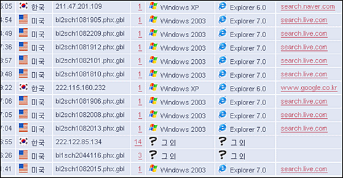

  

오른쪽의 리퍼러들 (search.live.com/~) 말고 왼쪽의 호스트명들을 한번 보세요.  

<!-- truncate -->

공식 최상위 도메인 (TLD - top level domain)에는 gbl 이라는 게 있지도 않을 뿐더러 [마이크로소프트](http://www.microsoft.com/)가 운영하는 [라이브닷컴](http://www.live.com)에서 검색된 건데, 주소가 \*.microsoft.com 은 아니더라도 \*.live.com 이라든지, \*.msn.com 혹은 \*.msn.net 정도는 되야 맞는 거 아닌가요? 아니면 그냥 아이피 주소를 사용하든지요.  
  
그래서, \*phx.gbl 이 찍히던 처음에는 [피닉스 글로벌](http://www.phoenixglobal.com.au/) 정도쯤 되는 이름을 가진 어느 회사에서 자사 홍보를 위해 뿌리는 일종의 신종 스팸 리퍼러인 줄 알았어요.  
  
그러다가 혹시 9/11 테러 이후에 미국에서 검색되는 각종 자료들을 통제하는 어떤 국가 차원 프로그램의 일부인가 싶은 생각도 했었죠. 그러니까 CIA (Central Intelligence Agency)나 FBI (Federal Bureau Investigation) 혹은 NSA (National Security Agency)처럼 [**피닉스 글로벌 인포메이션 시스템 (Phoenix Global Information Systems)**](http://www.phoenixintelligence.com/)의 어떤 프로그램이 아닌가 하는 생각 말이죠. **:p**  
  
뭐, 어쨌거나 신기한 건 왜 마이크로소프트 정도 되는 회사가 저런 가짜 도메인을 사용하느냐는 거죠. 심지어 핫메일, MSN메일의 헤더에도 \*.phx.gbl 이 찍혀있거든요.  
  
앞으로 TLD에 추가될 하나의 도메인을 적극적으로 테스트하는 걸까요? 아니면 메일, 웹, 메신저 등 여러 온라인 환경을 통합하기 위해 회사 내에서 사용하는 어떤 시스템의 이름이 피닉스 정도 되는 걸까요?
