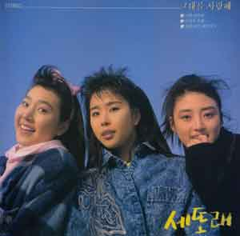
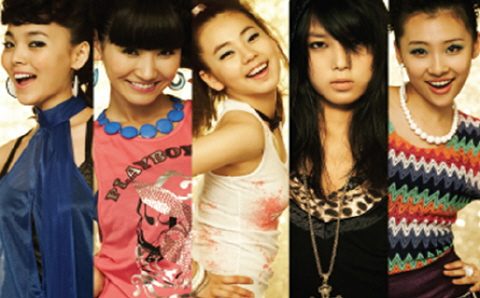

원더걸스가 정말 이슈이긴 이슈인가 봅니다. 전 그냥 우연히 들어보고 박진영 분위기 참 많이 난다 싶으면서도 많이 들어본 곡인 것 같아 찾아봤었거든요. 그런데, 한번 찾아보니 열풍이 불고 있더군요. ^^  

<!-- truncate -->

처음 들을 때 '아- 스테이시 큐의 곡을 샘플링 했구나.' 라고 생각하다가 '응? 이 정도면 리메이크라고 해도 되겠다-' 싶은 생각이 들었어요. 물론 제가 같은 멜로디, 같은 구조, 같은 장르라고 했을 때, 같은 멜로디가 정말 '똑같은' 멜로디라는 뜻은 아니었어요. 딱 들어도 비슷하다 그런 뜻이었지요.  
  
[staceyq\_discography.jpg](./staceyq_discography.jpg)  
이게 박진영의 실력 혹은 요즘 우리나라 작곡가들의 실력이라면 실력인데, 하나의 곡을 뜯어서 이리 붙이고 저리 붙이는 능력들이 대단합니다.  
  
예전 같으면 곡을 처음부터 끝까지 동일하게 사용한 다음에 음만 몇 개 고치고, 가사를 한국어로 바꿔서 불렀을 거예요. 중간에 영어도 섞고 말이죠.  
  
이렇게요.  
  

  
세또래 1집 (1988년)  
  
  
**세또래 - 행복해 (1988년)**

  
그동안 많이 발전(^^)한 거죠. 게다가 예전엔 스리슬쩍 몰래 가져다 쓰고 그냥 나몰라라 했지만, 요즘엔 하도 표절에 대해 민감하니 대부분 저작권을 정식으로 구입해서 사용하잖아요. (대부분 맞죠? ^^) 하긴, 몰래 스리슬쩍 쓰다보니 들키지 않으면서 원곡의 분위기를 최대한 살리려다 보니 실력이 는 걸까요? -\_-a  
  
아래 댓글들에도 적었지만 샘플링이면 어떻고, 리메이크면 어때요. 샘플링이 더 창의적이고, 리메이크는 좀 날로 먹고… 뭐 이런 것도 아니고 말이죠.  
  
제가 글을 적었던 건 '그냥 이 정도면 리메이크라고 해도 되지 않나?' 라는 생각이 들어서였어요. 어느 선이면 리메이크, 어느 선이면 샘플링… 이런 기준이 명시화되지 않는 한 홍보팀 혹은 작곡자가 말하기 나름이겠죠. (갑자기 전혀 엉뚱한 '오마주'와 '패러디'의 관계도 생각나네요. ^^)  
  
어쨌든 원더걸스의 팬으로 보이는 분들이 리메이크 혹은 번안곡 수준이라는 표현을 그리 좋아하지 않는 듯 하여 한번 나란히 붙여서 들어봤습니다. 텔미가 Two of Hearts 보다 반음 정도 올라있고, 템포는 조금 더 느리더군요. 그래서, 대충 비슷하게 맞췄습니다.  
  

**원더걸스 - 텔미 & Stacey Q - Two of Hearts**

  
자세한 설명은 생략하겠습니다. 사람마다 느끼는 게 다를 거라 생각하거든요. 참고로 제가 비교를 올려놓은 건 그러니까 이게 리메이크다 아니다 그런 의미는 아니예요. 참 센스있게 수정했구나 하는 의미입니다. ^^  
  
그냥 추측컨데, 원더걸스의 안티라면 이렇게 말할 것 같아요.  
이거 돈 있으면 다야? 돈 주고 사온 곡 여기저기 짜깁기 해서 만들었잖아!  
오리지날리티라는 게 있는 거야?  
역시 원곡의 포스는 따라갈 수 없어.  
요즘 애들이 뭘 몰라. 옛날 곡이 더 섹시하고 더 좋네 뭐.  
  
원더걸스의 팬이라면 (혹은 이 곡이 더 좋은 분들)이라면 이러겠죠?  
남의 곡을 사용해도 이렇게 다른 느낌으로 만들어 내다니 대단해!  
이건 정말 샘플링이 아니라 창조야, 창조.  
음악도 흥겨운데 음악에 딱 맞는 춤까지 추는 완소 원더걸스;  
비슷한 부분도 있는데 그건 샘플링일 뿐이고 곡이 참 세련되졌네.  
  
그런데, 저는 원더걸스라는 그룹을 아예 몰랐고, 이 곡도 크게 나쁘거나 좋거나 하지 않아서였는지 이것저것 찾아보고 난 후에 이랬죠. ^^  
이 정도면 리메이크라 해도 될 것 같은데?  
그래도 타이틀 곡인데 기왕이면 오리지널 곡으로 나오는 게 좋지 않았을까?  
박진영의 뽕끼는 여전하구나.  
  
  
그나저나 대략 웹서핑을 해본 결과 제가 분석한 판세를 말하자면, 초반에는 원더걸스와 소녀시대가 박빙이더니, (소녀시대 팬들이 들으면 서운하겠지만) 원더걸스 팬의 급격한 증가로 인해 적어도 지금 인터넷의 대세는 원더걸스인 듯 합니다.  
  
  
  

**관련글**  
  
리메이크와 샘플링의 차이는 뭘까요? 원더걸스 - 텔미 (Tell Me)
