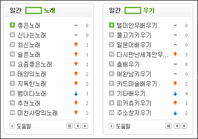
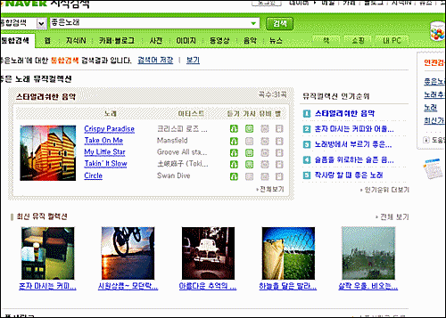

예전에 알짜매니아님 글에서 슬쩍 본 것 같은데, 네이버가 각종 검색 관련 특허를 차지하려고 노력하고 있다면서 그 중에 하나가 '~하기' 와 같이 한글에서 주로 사용되는 어미와 관련된 키워드 검색법을 소개한 적이 있었죠.  

<!-- truncate -->

그 글을 참 재밌게 읽었던 기억이 납니다. 이를테면 구글이나 야후 등 글로벌 기업들이 우리나라 검색/포털 시장에 들어오려고 애를 많이 쓰지만, 우리가 한글을 쓰는 이상 그들에게는 한글 자체가 진입장벽이니 우리나라 검색/포털 사이트들이 조금만 노력을 하면 그들에게 시장점유율을 쉽게 뺏기지는 않을 것이다… 이런 맥락으로 읽었거든요.  
  
아뭏튼, 그 때 언뜻 봤던 게 눈에 띄여서 캡쳐해봤습니다.  
  
  

**[ ]우기** 라는 검색 키워드는 정말 한국사람이 아니면 뽑아내기 힘든 키워드가 아닐까 싶어요. **배우기**만도 아니고, **키우기**만도 아니고, **지우기**만도 아닌 무언가를 한다는 의미의 어미를 잘 포착해 낸 키워드니까요.  
  
**[ ]노래**는 각종 음악 포털이나 스트리밍 음악 서비스 사이트에서 주로 하던 것이라 그리 특별할 것은 없지만 역시 네이버 답게 결과를 정리해서 뽑아주는 신공과 연결하니 그럴 듯 해 보이네요.  
  
개인적으로는 이렇게 편집되고 가공된 결과들을 그리 좋아하지 않지만 이건 제 개인적인 성향일 뿐 때론 유용할 때도 있고, 실제로 유용하게 사용하는 분들도 많이 계시겠죠.  
  
   

상대적으로 네이버는 막강한 시장 점유율 때문에 작은 시도도 쉽게 주목을 받고, 그런 측면에서 볼 때 욕도 더 많이 먹고, 칭찬도 더 많이 듣는 그런 사이트죠. 따라서 네이버가 이런 한글의 특성을 이용한 서비스들을 시도하는 것 자체가 다른 포털들에게도 많은 자극이 될 거라 생각해요. 한글의 특성에 맞는 멋진 서비스들이 더 많이 나오길 기대해 봅니다.  
  
그나저나 농담반 진담반으로 이야기하자면 **세종대왕님이 보우하사 우리나라 포털 만세-** 군요. :p
