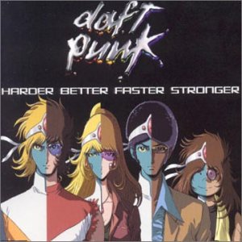

샘플링 샘플링 하니까 떠오르는 곡이 하나 있습니다. 요즘 인상 깊게 들었던 샘플링 곡인데요, 바로 카니예 웨스트 (Kanye West)의 **Stronger** 입니다. 이 곡은 다프트 펑크 (Daft Punk)의 **Harder, Better, Faster, Stronger** 를 샘플링해서 만든 곡입니다. 카니예 웨스트가 그의 왕성한 음악적 잡싱성(^^)을 발휘해서 다프트 펑크의 중독성 있는 비트를 그대로 들여와 힙합에 이식시킨 곡이죠.  

<!-- truncate -->

  
원곡의 팬들도 많기 때문인지 원곡이 좋다, 카니예 웨스트의 곡이 좋다… 의견이 분분하네요. 음… 저는 둘 다 좋긴 한데, 아주 미세한 차이로 다프트 펑크의 곡에 한표를 던지겠습니다. ^o^)  
  

**Kanye West - Stronger**  
  
  
뮤직비디오도 특이해요. 아예 대놓고 일본어가 화면에 들어가는군요. 전체적인 분위기도 뭐랄까… 일본 애니메이션의 명작 중 하나인 <아키라>에서 모티브를 따온 것 같습니다. 이쯤되면 정말 현란한 뒤섞기가 아닐까 싶군요. ^^  
  
전 이 곡의 제목이 재미있었는데, Stronger 잖아요. 들으면서 자연스럽게 '비트가 더 강해졌네 (stronger)' 했거든요. ^^ 후에 누군가 다른 편곡으로 Harder 도 한 곡, Better 도 한 곡, Faster 도 한 곡 만들면 좋겠어요. (개념상 Faster가 제일 만들기 쉽겠군요. ^^)

  
그리고, 예전에 제가 재밌게 봤던 Harder, Better, Faster, Stronger 관련 클립도 함께 보세요. ^^  
  

**Daft Hands - Harder, Better, Faster, Stronger**  
  
  
와우, 정말 x 100 멋진 아이디어입니다. 말이 필요없네요. 아이디어도 기발할 뿐더러 원테이크로 찍은 걸 보세요! 무수한 연습의 결과겠죠? ^^ 원곡이 가진 짧은 가사를 아주 효과적으로 표현해 낸 정말 멋진 클립입니다. 굳이 한 마디 더 하자면, 그 밴드에 그 팬입니다. ^o^

  

**Daft Punk - Harder, Better, Faster, Stronger (by iMitate Prod.)**  
  
  
iMitate Prod.라는 곳에서 만든 일종의 뮤직비디오입니다. 우리나라 인터넷에서도 선풍적인 인기를 끌었던(^^) 촬영방식 - 스톱모션 애니메이션이죠. 빨강티와 파랑티의 대결이 볼만합니다. ^^

  

**Daft Punk - Harder, Better, Faster, Stronger (A Cappella version)**  
  
  
와우! 아카펠라 버전입니다. 관객들의 호응이 좀 시끄러워서 잘 들리지는 않지만 어쨌든 재밌습니다. 중독성있게 반복되는 리듬이 아카펠라와도 잘 어울리는군요. 제법 멋집니다. ^^

  

**Kanye West - Stronger / Goodlife / Champion / Everything I Am (live on SNL)**  
  
  
마지막은 카니예 웨스트의 라이브 클립입니다. 세터데이 나잇 라이브 (Saturday Night Live)에서 공연했던 영상입니다. 여러곡을 메들리로 주욱 이어서 부르네요. 역시 라이브가 신납니다. :)
