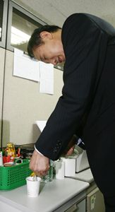

**2007.10.12.** **손수 커피 타는 이명박 후보**  
  
신문사 측에서 이 사진에 달고 싶은 설명은 이런 게 아니었을까?  
어머어머, 커피도 손수 타시고… **우리 이명박 후보**는 정말 서민인가봐. o(^o^)o  

<!-- truncate -->

...  
  
한편으로는, 유세 다 끝나면 자신이 하나님에게 봉헌한 서울시 어딘가에서 감사하는 마음도 없고 의욕도 없는 노숙자들을 피해 못생긴 마사지걸들과 함께 한물간 배우들이 나오는 영화 한 편 보다가 재밌는 장면이 나오면 5.18 묘지에서처럼 파안대소를 하며 스트레스를 풀다가 누군가 문득 존경하는 역사적 인물이 누구냐 하면 '도산 안창호씨'라고 자신있게 이야기하다가 문득 아들 사진이 보고 싶으면 히딩크와 함께 슬리퍼 차림으로 찍은 아들 사진을 꺼내 보며 감회에 젖을 것만 같은 서민 후보 이명박씨가 떠오른다.  
  
[▶ 기사보기](http://photo.chosun.com/site/data/html_dir/2007/10/12/2007101200560.html)

  

**2007.10.12.** **선관위 사칭 댓글 속지 마세요!**  

1. 선관위에서 위반 게시물을 발견하면 어떤 조치를 취하나?  
답변) 먼저 그것이 위반임을 해당 포털등에 알리고 그곳에서 처리하게 하며 혹은 이메일로 알린다. 이때 당연히 선관위임을 밝히고 위반사실도 알려준다.  
  
2. 혹시 댓글이나 이런 방법으로 조치를 취하기도 하나?  
답변) 전혀 그렇지 않다. 우리는 댓글로 조치를 취하지 않으며 그런 것은 선관위 사칭이다.  
  
3. 그럼 댓글로 위반이니 삭제하라든지 고발하겠다는 것은?  
답변) 위반여부는 오직 선관위에서만 판단하는 것이며, 그런 댓글은 선관위 홈페이지에 신고해 주기 바란다.

  
한글로님이 선관위에 문의한 바에 의하면 위와 같다고 합니다.  
  
[▶ 보러가기](http://www.hangulo.kr/122)

  

**2007.10.10.** **블룸버그 "이명박 공약, 거품억제 노력 무력화"**  
블룸버그는 "이명박 후보의 공약이 한국은행의 거품 억제 투쟁을 무력화하고 있다"는 제목의 기사에서 앤디 시에 전 모간스탠리 이코노미스트의 발언 등을 인용, "이명박 후보의 성장 우선주의 정책이 자산 거품 위험을 증가시키고 있으며, 과도한 한국의 가계 부채와 빠른 통화 증가 속도 등을 감안할 때 자산 인플레이션 위험을 배제할 수 없다"고 진단했다. 아아… 아무리 그래도 정말 운하는 팔 것 같아요. ㅠ.ㅠ  
  
[▶ 기사보기](http://news.media.daum.net/economic/industry/200710/09/Edaily/v18403361.html)

  

**2007.10.8.** **기자의 악의를 자극하면**  
하지만 capcold는 애초에, 도대체 왜 이 건이 이렇게 퍼지고 있었는지 자체부터가 좀 의아하다. 사람들이 마이데일리 같은 그저그런 연예뉴스사의 기사에 왜 그렇게 무조건적인 신뢰를 보내고 있는지 이해가 안간다. 포털사이트에서 뉴스보던 시절이 오기 전에, 지하철 가판대 타블로이드 ‘연예영화신문’에 나온 기사들을 보면서 그렇게 신뢰를 보낸 적이 있던가? 그 뭐냐, ‘배용준 벗었다’라고 1면에 써있으면, 그 밑에 조그맣게 “배용준이 이미지 쇄신을 위해 안경을 벗었다”고 써놓곤 했던 그 찌라시들 말이다. 아아, 그렇지. **사람들은 ‘마이데일리’ 뉴스를 본 것이 아니라, ‘네이버 뉴스’, ‘미디어다음 뉴스’를 본 것이라고 착각하곤 한다.** 듣보잡 3류 언론사의 찌라시성 기사나, 심층취재를 한 밀도 높은 기사나 모두 같은 지면으로 뒤섞여 있는데도 사람들은 그냥 하나의 ‘언론’으로 받아들여버리는 그 이상한 공간. 그래서 무려 제목에 ‘느낌표’가 붙어있는 쌈마이 티 줄줄 흐르는 기사에도 일희일비할 정도다(’PIFF에 불쾌해’!). 엘리베이터 안 회사 직원들의 대화에서 흔히 듣는 레퍼토리다. "앞으로 ㅁㅁㅁ가 ㅇㅇㅇ될 거래." **"정말? 어디서 봤어?" "네이버 뉴스에서."** 일상에서 자주 사용되는 말 아닌가 싶다. 네이버 뉴스에서, 다음 동영상에서, 아프리카에서 등등  
  
[▶ 보러가기](http://capcold.net/blog/?p=998)
