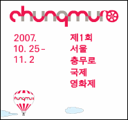
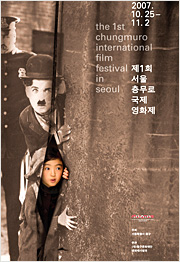
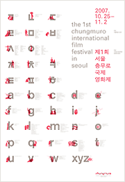

영화 잡지의 부록으로 티켓 카달로그를 받아 읽어본 적이 있는터라 이번달 말 즈음에 서울국제충무로영화제가 한다는 건 알고 있었는데, 개막하기 전에 축하공연도 있는 줄은 몰랐었다.  

<!-- truncate -->

  
그제 시청 광장에서 시끌벅적하게 무대를 꾸미고 리허설을 하는 걸 보다가 출연진을 보니 승환옹과 해철옹이 있는 게 아닌가; 하여 어제 퇴근 후 비가 온 후라 추운 날임에도 불구하고 ㄹ모님과 함께 덜덜덜 떨면서 3시간 이상을 기다린 끝에 해철옹과 승환옹의 공연을 보고 왔다. 추위를 버티며 기다린 것에 비해 공연은 짧았지만 뭐 가까이서 본 걸로 만족; - 출연진은 중구심포닉밴드, 럼블피쉬, 충무로밴드, 넥스트 그리고 이승환  
  

**어제의 말말말**  
  
- 해철옹이나 승환옹이나 어디가서 꿀리지 않는데, 승환옹이 피날레라니, 해철옹이 맘 좀 상했겠는데요? (공연순서를 확인하고는 ㄹ모님에게 내가. 실제로 해철옹은 추워서 오돌오돌 떨고 있는 관객들을 향해 '이따 이승환 나오면 어떻게 할라고 벌써부터 지쳤냐'는 멘트를 날리기도;; )  
  
- 그런데, 명색이 충무로영화제인데 축하공연이라고는 하지만 영화 배우는 한명도 안왔다는 건 좀 문제가 있는 거 아니예요? (공연이 시작되고 누군가 축사를 할 때 내가)  
  
- 그러게 평상시에 돈 내고 공연가서 봐요. 그럼 안 기다려도 되잖아;; (언제쯤 승환옹이 나오냐는 ㄹ모님의 투덜에 내가)  
  
- 안녕하세요. 저희는 넥스트입니다. (남자 사회자가 '신해철과 넥스트입니다' 라고 소개한 게 걸렸는지 노래 두 곡 부른 후 숨을 고르며 해철옹이)  
  
- 발라드 괜찮아? 이렇게 추운데? 발라드? 발라드? 추운데? 오케이. 그래도 발라드 하나. ('어떻게 사랑이 그래요' 를 부르기 전 관객들이 추울까봐 걱정하며 승환옹이)  
  
- 꺄악~ (긴 기다림 끝에 승환옹을 무대 바로 앞에서 본 ㄹ모님이)

  

  
무대 중앙에 큰 스크린이 마련되서 공연 때마다 적절한 영상들이 흘러나오기도 하고, 무대 사운드도 괜찮고 여러모로 다 좋았는데, 중구심포닉밴드라든지 충무로밴드가 연주한 곡들이 다들 헐리우드 영화의 음악들이어서 좀 아쉬웠다.  
  
이를테면 중구심포닉밴드가 유명한 영화음악을 메들리로 연주하는 순서가 있었는데, 중앙의 영상은 영화제가 영화제이다 보니 고전부터 최근작까지 한국의 영화 포스터들이 지나가고 있었다. 그러다 보니 씨받이 포스터가 지나갈 때 디즈니의 피노키오 사운드트랙 중의 하나인 When You Wish Upon a Star 가 연주되는 일이 벌어지기도;;; 기분이 좀 묘했...다.  
  
  
영화제 성격에 맞게 한국의 영화음악들을 연주했으면 정말 정말 훨씬 더 좋았을 거란 생각이 든다. 우리나라 음악들도 좋은 곡들 많은데 말이지.  
  

**제1회 서울국제충무로영화제 리더필름 보기**

  

**관련링크**  
  
[**제1회 서울충무로국제영화제 홈페이지 바로가기**](http://www.chiffs.kr/)
