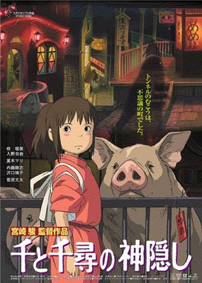
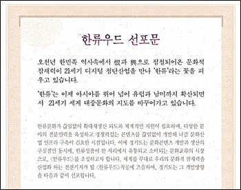

[**스트리트 파이터 4 (Street Fighter 4) 트레일러**](http://www.youtube.com/watch?v=MZP3WYiOncI)  

<!-- truncate -->

와- 정말 멋지군요!  
  
보면서 문득 우리에게 이어져 오는 전통이란 게 얼마나 있나 하는 생각이 들었습니다. 박물관이나 역사책에만 존재하는 그런 전통 말고, 일상 속에서 느껴지는 전통 말이죠. 그런 면에서 보자면 일본은 참 이런 걸 잘하는 것 같아요. 확실히 전통적인 요소를 문화창작물 속에 잘 집어넣죠. 제 편견일지 모르지만 우리는 정부가 보조금을 지원하며 이런저런 시도를 해도 잘 안하잖아요. 물론 전통문화 분야에서 묵묵히 노력하고 계시는 분들도 있지만 어떤 현대적인 트랜드와 조화되는 경우는 보기 힘들어요.  
  
  
<센과 치히로의 행방불명> (2001)을 봤을 때 정말 놀랐던 기억도 납니다.  
애니메이션 전반의 강한 일본색은 강한 자신감에서 나온다고 생각했어요.  
일본의 경우 책이나 영화를 봐도 혹은 제가 나가서 봤을 때도 보면 사무라이, 기모노, 스시, 일본식 분재 등 널리 알려진, 보편화된 세계 문화의 일부라고 생각될 정도로 요즘의 문화에 잘 어울리죠. 중국은 아직 산업적으로 앞서있지 않기 때문에 잠잠한 듯 하지만, 이제 조금 후면 (베이징 올림픽) 여러 면에서 부각이 될 것 같고 그러면 이제 슬금슬금 해오던 것들이 떠오르겠지요.  
  
이거 먹물이 튀는 듯한 특수효과 하나 보면서 별 생각을 다 하는군요.  
  
  
보면 볼수록 참 신기한 이름. 그나마 영문 표기는 Hallryuwood 입니다. 할류웃.  
참, 이와 관련해서 최근에 가장 황당했던 때는 [동사무소를 주민센터로 바꾼다는 기사](http://news.media.daum.net/society/region/200708/31/yonhap/v17976943.html)를 봤을 때였습니다. 아니, 왜 우리나라 정부가 앞장서서 우리 글인 한글을 말아먹고 있는 건가요? 예전에도 [전 경기도지사가 한류우드를 야심작](http://blog.segye.com/sonpeople/19762)이라고 하는가 하면, 이제 곧 전국토를 두고 삽질 예정 중인 모 대통령 후보는 [국어, 국사 교육을 영어로 하자](http://news.hankooki.com/lpage/politics/200710/h2007100913532021060.htm)고 하지 않나… 세종대왕이 보기에 우리는 아직도 어여쁜 백성일 듯 합니다.
