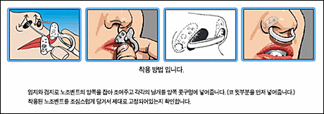

**2007.10.21.** **MBC화면이 남다른 이유**  
스튜디오 제작의 경우에는 조명, 영상 근무자가 색상, 밝기, 선명도 등을 최적의 상태로 조정하기 위해 많은 노력을 기울인다. 야외에서 한 대의 ENG카메라로 제작되는 경우에는 종합편집실에서 매 컷마다 손질해 통일된 색감과 일정한 밝기를 유지한다. 시간이 많이 걸리고 힘도 들지만 이것이 MBC 전통으로 자리 잡기도 했고, 일하는 사람들의 열정이 남다르기 때문에 결코 이 방식을 포기하지 않는다고. 이유야 어쨌든 나도 오래 전부터 MBC의 색감, 질감을 (공중파 3사 가운데에서) 제일 좋아했다. 어렸을 때 '왜 저렇게 다를까', '다른 방송국도 보면 알텐데, 왜 저 상태로 계속 방송할까' 하는 의문을 가질 정도로. :$ 굳이 비교하자면, KBS는 너무 덜 꾸민 듯 밋밋하고, SBS는 심도가 얕아 보인다.  

<!-- truncate -->

[▶ 보러가기](http://www.magazinet.co.kr/COMMUNITY/review_view.php?no=416&page=1&s_key=mbc&s_field=title)  
  
[▶ 매거진T - [죽어도 HD!] 기술은 진화하고 인간은 적응한다](http://www.magazinet.co.kr/Articles/article_view.php?mm=012001001&article_id=40319)  
[▶ 매거진T - [죽어도 HD!] HD? 피할 수 없다면 찍어라](http://www.magazinet.co.kr/Articles/article_view.php?mm=006001000&article_id=40321)  
[▶ 매거진T - [죽어도 HD!] HD와 함께 빛났던 그 드라마, 그 순간들](http://www.magazinet.co.kr/Articles/article_view.php?mm=006001000&article_id=40320)

  

**2007.10.20.** **우유를 싫어하는 아이들에게 주는 선물 (Sipahh)**  
이 빨대의 원리는 매우 간단 합니다 빨대안에 향이나는 과립이 들어 있어 우유를 빨대로 빨아 먹으면 빨대속의 과립과 우유가 혼합되어 우유맛을 바꾸어 주는 그런 형태입니다 물론 빨대의 양끝은 과립이 흘러 빠지지 않을 정도의 구멍이 있습니다. 아이디어는 참 좋다. 그런데, 국내 판매가는 너무 비싸다. 누군가 같은 기능의 빨대를 값싸게 내놓거나 김치 잘 먹게 하는 빨대, 야채 잘 먹게 하는 빨대 같은 걸 만든다면 대박 날 듯;;;  
  
[▶ 가서보기](http://littlegold.tistory.com/104)

  

**2007.10.18.** **코골이 방지 기구 노조벤트 (NOZOVENT)**  
  

오오- 이런 것도!  
  
[▶ 보러가기](http://www.funshop.co.kr/vs/detail.aspx?no=0757994441)

  

**2007.10.15.** **MS, 정품 인증 없이도 익스플로러 7 다운로드 허용**  
자매 사이트 ZDNet 독자 여론조사에 따르면, 응답자 가운데 55%는 MS는 WGA가 못마땅한 DRM 제도와 다를 바가 없다고 간주하는 기술 브라우저 이용자들에게 호소함으로써 IE7 시장점유율을 높이기 위해 WGA를 중단했다고 답했다. 이 의견에 나도 한표. 당장 정품 몇 카피 더 파는 것보다 이제껏 독점으로 유지했던 브라우저 시장 점유율을 유지하는 게 훨씬 더 중요할테니깐.  
  
[▶ 기사보기](http://www.zdnet.co.kr/news/internet/browser/0,39031243,39162124,00.htm)
