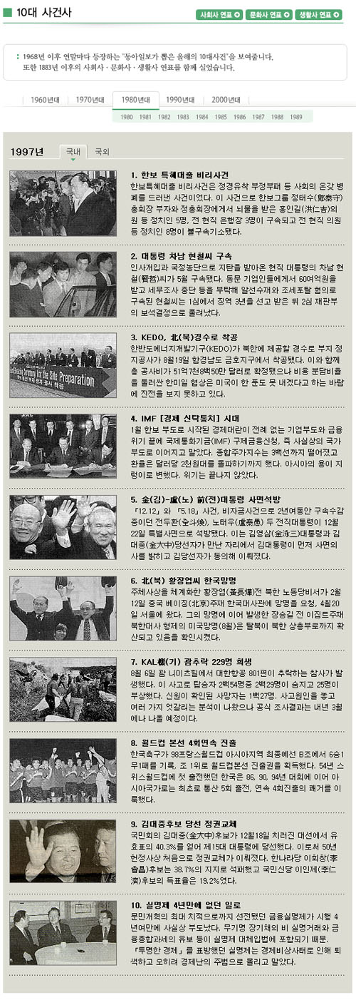

> 한나라당 정책위원회(의장 이한구)는 21일 "(김대중.노무현 정권의)지난 10년간은 경제.집값.실업.교육.안보.헌법대란 등 '육란(六亂)시대'였다"고 주장했다. 당 정책위는 이날 '잃어버린 10년, 신고한다'는 제목의 보도자료를 내고 '육란시대'의 근거로 ▶양극화 심화 ▶세금폭탄 ▶부동산가격 폭등 ▶공교육 붕괴 ▶언론탄압 ▶청년실업 급증 ▶대북 퍼주기를 들었다.  
>   
> 출처 : [중앙일보 - 지난 10년 경제·집값·실업·교육·안보·헌법 `6란 시대`](http://news.joins.com/article/2921290.html?ctg=10)

<!-- truncate -->

  
한나라당은 저런 이유로 10년을 잃어버렸다고 합니다. 문득 한나라당이 집권하던 10년 전에는 어떤 일이 있었는지 궁금해졌습니다. [**신문박물관**](http://www.presseum.or.kr/bbs/issue_10.php?no=199701)에서 10년 전 (1997년) 10대 사건 중 1위부터 5위까지를 한번 살펴봤어요.  
  

**동아일보가 뽑은 1997년의 10대 사건 중 1위부터 5위** (출처 : [**신문박물관**](http://www.presseum.or.kr/bbs/issue_10.php?no=199701))  
  
**1. 한보 특혜대출 비리사건**  
한보특혜대출 비리사건은 정경유착 부정부패 등 사회의 온갖 병폐를 드러낸 사건이었다. 이 사건으로 한보그룹 정태수(鄭泰守)총회장 부자와 정총회장에게서 뇌물을 받은 홍인길(洪仁吉)의원 등 정치인 5명, 전 현직 은행장 3명이 구속되고 전 현직 의원 등 정치인 8명이 불구속기소됐다.  
  
**2. 대통령 차남 현철씨 구속**  
인사개입과 국정농단으로 지탄을 받아온 현직 대통령의 차남 현철(賢哲)씨가 5월 구속됐다. 동문 기업인들에게서 60여억원을 받고 세무조사 중단 등을 부탁해 알선수재와 조세포탈 혐의로 구속된 현철씨는 1심에서 징역 3년을 선고 받은 뒤 2심 재판부의 보석결정으로 풀려났다.  
  
**3. KEDO, 北(북)경수로 착공**  
한반도에너지개발기구(KEDO)가 북한에 제공할 경수로 부지 정지공사가 8월19일 함경남도 금호지구에서 착공됐다. 이와 함께 총 공사비가 51억7천8백50만 달러로 확정됐으나 비용 분담비율을 둘러싼 한미일 협상은 미국이 한 푼도 못 내겠다고 하는 바람에 진전을 보지 못하고 있다.  
  
**4. IMF [경제 신탁통치] 시대**  
1월 한보 부도로 시작된 경제대란이 전례 없는 기업부도와 금융위기 끝에 국제통화기금(IMF) 구제금융신청, 즉 사실상의 국가부도로 이어지고 말았다. 종합주가지수는 3백선까지 떨어졌고 환율은 달러당 2천원대를 돌파하기까지 했다. 아시아의 용이 지렁이로 변했다. 위기는 끝나지 않았다.  
  
**5. 金(김)-盧(노) 前(전)대통령 사면석방**  
「12.12」와 「5.18」사건, 비자금사건으로 2년여동안 구속수감 중이던 전두환(全斗煥), 노태우(盧泰愚) 두 전직대통령이 12월22일 특별사면으로 석방됐다. 이는 김영삼(金泳三)대통령과 김대중(金大中)당선자가 만난 자리에서 김대통령이 먼저 사면의사를 밝히고 김당선자가 동의해 이뤄졌다.

  
한나라당은 육란 어쩌고 하면서 지난 10년을 잃어버렸다고 주장하는데, 오히려 저 10년 전이 더 그리운가 봅니다.  
  
정경유착에, 대통령 아들이 구속되고, 우방과의 협상은 진전되지 못했으며, 급기야는 대한민국 경제를 산산이 무너뜨렸으며, 시민에게 총칼을 겨눴던 사람들을 사면시켰던 때가 말이죠. 아직 해먹을 게 더 남았다고 생각하는지도 몰라요.  
  
그나마 동아일보가 뽑아서 IMF가 4위이지, 국민 정서로 따지면 IMF가 1위일 겁니다. 나라 경제를 말아먹은 패거리가 10년도 안되서 이리도 큰 소리치는 걸 보면 정말 세상이 좋아지긴 좋아졌나봐요.  
  
생각만 해도 무섭습니다. 아니, 이제 그들이 너무 노골적이어서 무섭다는 말도 못하겠어요. 한나라당 출신 경제 대통령이요? 에이, 농담이겠지요.  
  
p.s. 혹시 이게 10년 전, 즉 1997년에 일어난 안 좋은 사건 1위 ~ 5위라고 생각한다면 천만에요. 8위에 월드컵 본선 4회연속 진출이 있거든요.  
  
  

크기를 위해 [**신문박물관**](http://www.presseum.or.kr/bbs/issue_10.php?no=199701)의 레이아웃을 적당히 조절했습니다.
