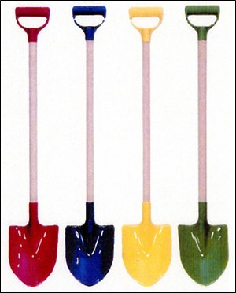

> 진씨의 폭탄 발언은 이때 나왔다.  
>   
> 진씨는 “변희재 씨가 포털에서 이명박 후보에 불리한 기사가 안 올라간다 했는데, 내가 밤새 전화 걸어서 막았다”며 “네이버는 평정되었는데, 다음은 폭탄이라 예의주시하고 있다. 다음의 석종훈 사장과는 이야기가 잘 되는데 밑에 사람들이 안 따르는 것 같다”고 말했다.  
>   
> (중략)  
>   
> 변씨는 당시 간담회를 끝나고 나오면서, 진씨 에게 “(포털에) 기사 올려 달라, 내려달라, 이렇게 사정하지 말고, 너희 정권 잡으면 죽는다며, 더 세게 나가시오”라는 조언까지 했다고 밝혔다.  
>   
> 출처 : [**고뉴스 - "정권 잡으면 너희 다 죽는다"… 이명박 ‘포털 회의’ 파문**](http://kr.news.yahoo.com/service/news/shellview.htm?linkid=437&articleid=20071024152030195a3)

<!-- truncate -->

  
아래 글도 10년 전 이야기였는데 이건 뭐 10년 전 시리즈도 아니고, 요즘 화제가 되고 있는 이 기사를 보니 10년 전의 말들도 생각나더군요. 우연찮게 그 때 나왔던 살벌한 이야기도 한나라당쪽 후보였지요.  
  

> "창자를 뽑아버리겠다. 씨를 말려버리겠다"  
>   
> 한나라당 총재경선 바로 하루 전인 지난 5월 30일. 그날 아침 한겨레신문을 읽던 독자들은 깜짝 놀랐을 것이다. 6면 하단에 실린 책광고의 문구가 심상치 않았기 때문이다. 광고는 시정잡배도 입에 담기 어려운 이 끔찍한 폭언의 주인공이 이회창 한나라당 총재라고 밝혀놓고 있었다. 화제의 이 책은 전 중앙일보 사진기자 오동명씨가 쓴 『당신 기자 맞아?』. 커다란 활자 아래에는 작은 활자로 다음과 같은 문구가 쓰여 있었다.  
>   
> "자기에게 좋지 않은 기사를 썼다고 기자의 면전에서 '창자를 뽑아버리겠다'고 차마 입에 담을 수 없는 욕설을 퍼부은 이회창씨. 그 앞에서는 영낙없이 '꼬봉'이 되는 거대 신문 편집국장… 실명 비판의 대명사요 언론문제에 정통한 강준만 교수조차 완전히 사로잡아 끌어안고 잠들게 만든 바로 그 책… 뒤가 구린 언론들이 감히 다루지 못했을 뿐 이 책은 이제 알 만한 사람들에 의해 입에서 입으로 전달되고 있습니다. 단지 누구를 욕보이고자 쓰여진 책이 아닙니다. 소문의 진상을 확인하십시오."  
>   
> 출처 : [**디지털말 - "창자를 뽑아버리겠다" 이회창 발언은 사실**](http://modu1.urimodu.com/cgi-bin/CrazyWWWBoard.cgi?mode=read&num=566&db=newfree&backdepth=1)  
>   
> (아쉽게도 말지가 폐간되는 바람에 원출처가 사라져버렸군요;; )

  
위의 이야기는 후에 '창자론'이라는 이름이 붙었지요. 고려대 나오고도 기자될 수 있냐고 물었다던 회창옹의 모습이 눈에 아른거리는 듯 합니다. 뭐랄까, 당의 기풍은 10년 전이나 지금이나 비슷한 것 같아요. 정말 위세당당합니다.  
  
그러고 보니 조선일보의 김대중 주필도 이런 얘기를 했다 그러죠.  
  

> 1997년 이인제 대통령후보측 사람들이 조선일보가 편파보도를 한다며 조선일보 사옥 앞에서 항의를 할때 조선일보 김대중주필이 술에 취해 나타나 한 말이『너네들 뭐하는 거냐?.... 너네들 내일 모래면 끝이야. 국민회의(김대중), 국민신당(이인제) 너희는 싹 죽어, 까불지마 내일모래면 없어질 정당이....』였다. 이회창의 당선을 확신하는 말투였다고 한다... 권력의 감시자가 아니라 대한민국의 권력은 자기들이 만든다는 오만에 찬 태도였다...   
>   
> 출처 : [**강준만 - 한국언론 117년사**](http://www.aladdin.co.kr/shop/wproduct.aspx?ISBN=8988410300)

  
이 책은 제가 읽어보지 않아서 확실하지는 않습니다. 누구 읽으신 분들이 확인해 주셨으면 해요. ^^ 만약 사실이라면 이런 속담이 어울리겠지요. **서당개 삼년이면 풍월을 읊는다.** 오랫동안 권력에 붙어있던 사람들만이 가질 수 있는 호연지기겠지요.  
  
아뭏튼 벌써부터 이렇게 확신을 가지고 계신 분들이 계시다니… 하지만, 저 역시 그렇습니다. 뭐, 이변이 없는 한 정권 잡으면 다 죽여버린다는, 예전에는 창자를 뽑아버린다는 그쪽 당 후보가 될 것 같아요. 흑흑.  
  
인터넷 서핑하다 가끔씩 위대한 한반도 대운하 사업이 떠오를 때면, 쇼핑몰에서 삽을 검색해보기도 합니다. 삽 사진을 찾아보기도 하죠. 색깔별로 예쁜 삽들을 보면 기분이 나아질 법도 한데 쉽진 않더군요. @.@  
  
  
  
기분이 쉽게 좋아지지 않는다는 걸 알고는 깨달았습니다. 삽 사진 검색 말고 다른 **무언가**를 해야겠다는 걸 말이죠.  
  

**추가**  
  
저 아래 걸린 트랙백 [**찌라시 언론보다 더한 블로거들의 난독증**](http://trend25.tistory.com/2630610)에 대한 제 답변입니다.  
  
 **답변 내용 보기** 

일단, 저는 진씨의 말에 대해서는 언급한 적이 없고, 기사에서 변씨의 말에 대한 부분을 인용했습니다. 그런데, 링크하신 (변씨가 직접 작성한) 빅뉴스의 기사를 보면 다음과 같이 되어있습니다.  
  
[필자는 간담회를 끝나고 나오면서, 진성호 간사에게 “기사 올려달라, 내려달라, 이렇게 사정하지 말고, 너희 정권 잡으면 죽는다며, 더 세게 나가시오.”라는 조언까지 한 바 있다. 진성호 간사가 포털에 기사를 내리라고 전화를 걸었다면, 그건 비판받아야할 일이 아니라, 진성호 간사의 업무력을 높이 평가해야할 일이다. 본질적으로 포털 문제를 해결하는 것과, 정당과 대선캠프에서 포털을 활용하는 것은 전혀 다른 차원의 문제이다.]  
  
비꼬면서 했다는 말은 없네요. 즉 변희재씨가 직접 작성한 기사에서도 "조언"이라는 표현을 하고 있습니다. [본질적으로 포털 문제를 해결하는 것과, 정당과 대선캠프에서 포털을 활용하는 것은 전혀 다른 차원의 문제이다.] 라는 표현을 보면 저 정확해지잖아요. [전화질을 하든 술을 사든, 사정을 하는 것이다.] 라며 공식적인 방법이 아닌 방법을 너무나 자연스럽게 이야기하기 까지 하는 사람이 조언을 한 것이죠.  
  
그럼 정권을 잡으면 정말로 죽이겠느냐 하는 건데요, 예전에 이회창옹이 창자를 뽑아버리겠다고 한 것도 사실 진심은 아니었겠지요. 할아버지가 어떻게 젊은이들 창자를 뽑겠습니까. 다만, 그의 언론관을 보여주는 말이기 때문에 회자가 된 것이겠지요. 변희재씨도 인터넷미디어협회 정책위원장이기 때문에 문제가 될 수 있는 것이지요.  
  
잘못한 게 있으면 사과를 하고 시정을 하면 되는 거고, 오보가 나갔으면 공식적인 루트를 통해 정정보도를 요청하든 고소를 하면 되는 것입니다. 그런데, 막말로 협박이라도 하라는 거잖아요.  
  
원래 뜻은 '그렇게라도 강하게 나가라' 라는 뜻으로 조언했을지도 모르지만, 그런 걸 의도라고 하는 거지요. 면대면으로 누군가에게 '너 이거 안들어주면 다 죽는다' 라고 말하면 협박 아닙니까.  
  
제가 여전히 난독증 상태라 이렇게 반문을 하는지도 모르겠습니다. 그렇다면 어디가 저 문장은 비꼬는 의도에서 한 말이었는지, 왜 별 문제가 안되는 것이었고, 어떤 지점에서 낚였는지를 알려주시면 감사하겠습니다. ^^ 그리고 다음부터는 찌라시 언론보다 어쩌고 하며 증세를 먼저 이야기하시기 보다는 조금 더 친절하게 조언해 주시면 고마울 것 같아요. 그나저나 국어가 어렵긴 어렵나 봐요.
