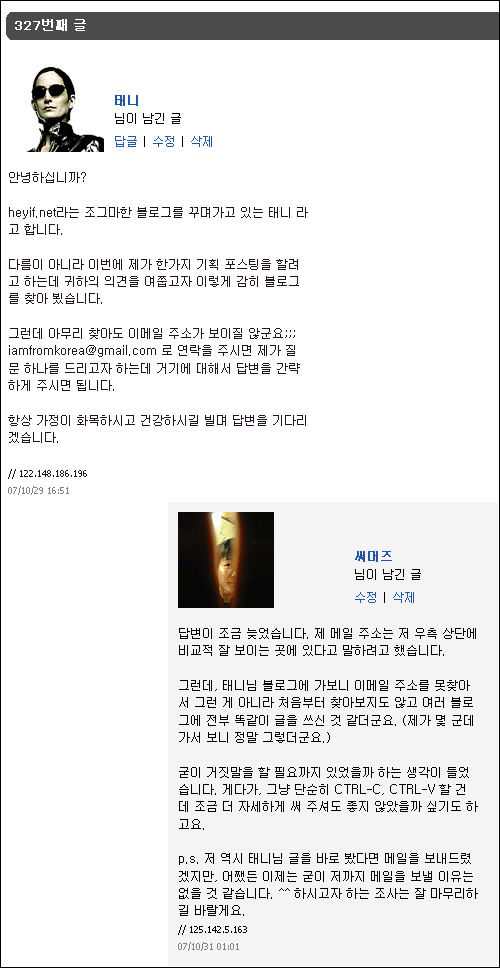

  
한참 방문자수에 목숨 걸었던 시절의 저였다면 '오호라, 저런 식으로 글을 적고 다니면 방문자 수가 엄청나게 늘겠는데?' 하는 생각을 했을 듯 싶어요. 홈페이지를 처음 가졌던 시절에는 실제로 싸이 이웃방문 하듯이 각자의 홈에 들락날락거리기도 많이 했죠. ^^ (물론 [태니님](http://heyif.net/)이 지금 그렇다는 뜻은 아닙니다.)  

<!-- truncate -->

저에게만 적은 글인 줄 알았는데 알고보니 여기저기 똑같이 쓰여진 글이라고 알게 되니 재밌지만은 않네요. ^^ 그게 뭐 중요한가 싶기도 하지만, 어쨌든 댓글도 늦게 단 김에 저는 패스하겠습니다. ^^  
  
p.s. 뭐 어떻게 보면 광고는 광고지요. 실제로 태니님 블로그에 가보면 [설문조사를 통한 포스팅을 하겠다고 광고를 한 상태](http://heyif.net/33)니까요. 그런 의미에서 '광고?'라고 적은 거예요.
