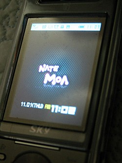
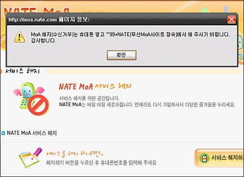

예전에 **SKT의 뮤직자유이용권**에 대해 글을 작성한 적이 있습니다. 그 글을 작성할 당시의 상황을 간단하게 다시 설명하자면,

<!-- truncate -->

- 어떤 경로로 웹상의 이벤트에 참여하게 됐다.
- 그 결과 뮤직자유이용권 (1주일 무료)이라는 서비스에 가입하게 되었다.
- 1주일이 되기 전에 고객센터(114)에 전화를 걸어 모든 이벤트성 서비스를 해지했다.
- 그런데, 1주일이 지나니 요금 청구가 되었다.

**관련글**

**SKT의 뮤직자유이용권 이야기** **SKT의 뮤직자유이용권 이야기 그 후** **SKT 뮤직자유이용권, 결국 요금 청구**

저에겐 일상이 바빠지는 바람에 결국 항의를 계속하지 못하고 지나갔던 기억이죠.

* * *

그런데, 오늘 아침에 일어나서 핸드폰을 켜보니 대기화면이 저도 모르는 화면으로 바뀌어 있더군요.

아니, 이건 또 어디서 듣도 보도 못한 화면과 로고인가! 네이트 모아? NATE라고 적혀있는 걸로 보아 분명히 SKT와 관련이 있는 거겠군요. 인터넷을 찾아봤더니 바로 기사가 나오는군요.

> 나도 모르게 휴대폰 대기화면이 바뀌는 현상때문에 SK텔레콤 가입자들 중 많은 사람들이 고통 받고 있다.
>
> SK텔레콤이 고객 동의를 제대로 받지 않고 푸시형 광고 및 정보 서비스인 '네이트 모아(NATE MoA)'를 제공하고 있기 때문이다.
>
> ' 네이트 모아'는 단말기 대기 화면을 통해 멀티미디어 콘텐츠를 제공하는 푸시(Push)형 서비스. 휴대폰 화면에 저절로 날씨·영화·뮤직비디오 등의 콘텐츠가 나타난다. **이 서비스는 SK텔레콤과 와이더댄닷컴이 투자한 모바일 마케팅 대행사인 에어크로스(www.aircross.com)가 제공한다.**
>
> (중략)
>
> **원래는 114나 휴대폰 SMS 등을 통해 가입신청을 받고 서비스해야 하지만, 신청하지 않았는데도 저절로 가입되는 경우가 많기 때문이다.** 특히 휴대폰을 최근에 교체했거나 우량 가입자인 경우 피해에 더 많이 노출돼 있는 것으로 알려졌다.
>
> 첫 화면을 가족사진으로 꾸며놓았더라도 아침에 일어나면 ▲ MoA 날씨▲ MoA 라이프 ▲ MoA 뮤직비디오 같은 말과 함께 생소한 화면(\*\*99+통화 버튼을 누르세요)이 휴대폰 대기 화면에 뜨는 것.
>
> (후략)
>
> 출처 : [**아이뉴스24 - SKT고객들 '모아' 서비스에 불만..가입자 동의없이 휴대폰 대기화면 바꿔**](http://www.inews24.com/php/news_view.php?g_serial=131556&g_menu=110600)

SKT 입장에서 보자면 예전에는 뮤직자유이용권 경우처럼 고객을 은근 슬쩍 이벤트성 서비스에 가입시켜놓고 해지를 늦게 시켜 고객 돈을 빼가더니 그게 잘 안되니까 아예 고객 동의도 없이 서비스에 가입시켜 버리는군요.

이것 역시 고객센터에서 현재 사용 중인 부가서비스에 잡히지 않습니다. 아무래도 주체가 SKT가 아니라 SKT가 투자한 회사를 통해 간접적으로 서비스되기 때문이 아닐까 싶어요. (그렇다면 정말 잔머리를 잘 쓴 거군요.)

첫화면은 무료니까 정보성 서비스라고 둘러댈 수는 있겠지만 그 이후부터는 바로 유료서비스로 넘어가니까 사실상은 한단계 업그레이드 된 낚시 운영이라 할 수 있을 것 같아요.

해지하는 방법은 다음과 같다고 합니다.

**NATE MoA (네이트 모아) 서비스 해지 방법**

**1. \*\*99 + NATE (무선 MoA 사이트 접속)
2. 우측 상단에 [수신동의] 선택
3. ①수신거부 하기 선택**

**하지만 제 생각엔 그냥 고객센터 (114)에 전화해서 해지해달라고 하면 될 것 같아요.**

 \*\*99 + NATE 로 들어가라는 건 위 그림처럼 [네이트에 적혀있는 방법](http://moa.nate.com/New_MoA_Web_Phone/New_MoA_Web_Phone2/outsider/MoA_Join/Moa_join05.htm)인데, 생각할 수록 기분 나쁜 건 이 과정에서 별도의 수신료가 든다는 겁니다.

고객의 동의도 받지 않고 서비스 가입시켜놓고 해지하려면 돈이 든다니, 게다가 핸드폰 인터페이스에 익숙하지 않은 분들은 어떻게 해지하는지 잘 몰라 한참 헤매다 보면 수신료가 더 나올지도 모르는데, 이거 좀 너무한 거 아닌가요?

이건 뭐 고객이 KO 할 때까지 계속 시도하는군요.
