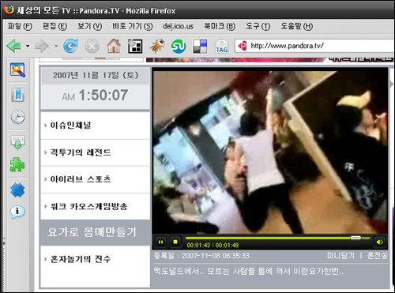
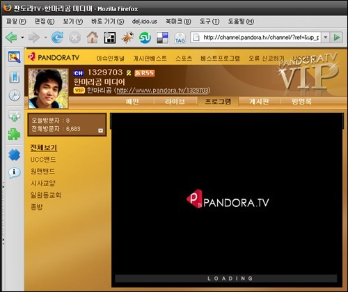

저는 인터넷으로 동영상을 볼 때 Pandora TV (판도라 티비, 판도라 TV)는 들어가지 않습니다. 액티브엑스를 깔아야만 볼 수 있기 때문이었죠. 제가 주로 사용하는 브라우저는 파이어폭스인데 파이어폭스에는 액티브엑스를 설치할 수 없기 때문이기도 하고요.  

<!-- truncate -->

하지만 오늘 (파이어폭스를 사용해서) 들어가니 메인 화면에서 동영상을 재생할 수 있었습니다.  
  
  
오오-  
그래서 다른 동영상들을 클릭해 봤습니다.  
  
  
메인의 동영상은 됐는데 여기는 재생이 되지 않았습니다.  
메인을 제외한 다른 곳의 동영상들은 파이어폭스에서 로고가 박혀있는 로딩 중 화면에서 넘어가지 않았습니다.  
  
그래서 인터넷 익스플로러로 접속해 봤습니다.  
  
  
재생이 잘 됩니다.  
여기서 중요한 건 **제 인터넷 익스플로러에는 Pandora TV의 액티브엑스를 설치한 적이 없는데 동영상이 재생된다**는 점입니다.  
  
  
장면이동을 하려고 했더니 프로그램을 설치하라고 나옵니다.  
특정 기능을 사용하려고 했더니 프로그램을 설치하라고 나옵니다. 이 정도면 많이 좋아진 게 아닌가 싶어요. 선택권이 사용자에게 있으니까요.  
  
인터넷 익스플로러에서도 기본 재생은 액티브엑스 없이 되는 걸로 보아 파이어폭스에서도 되는 건데 뭔가 버그가 있는 건가 봅니다. 메인에서 동영상이 재생되는 것도 그렇고요, 조만간 버그가 수정되겠죠. 어쨌든 언제부터 이렇게 바뀌었는지 신기하네요.  
  

**덧말**  
  
사실 예전부터 신기(?)하긴 했습니다. 액티브엑스를 설치해야만 동영상을 볼 수 있는 Pandora TV가 국내 동영상 사이트의 부동의 1위라는 점이 말이죠.  
  
그만큼 우리네 인터넷 환경에서는 액티브엑스가 일상적이라는 걸 반증하는 거라고 생각했죠.
