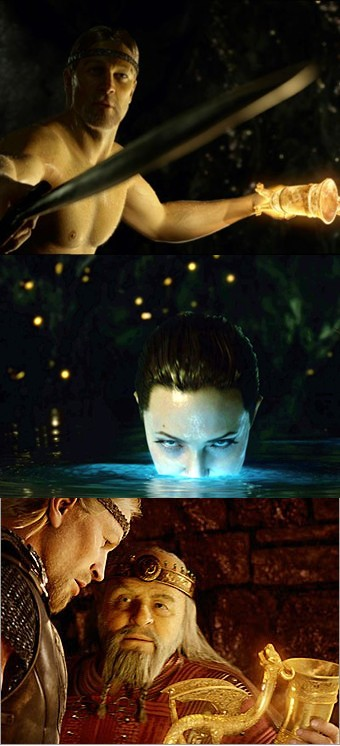
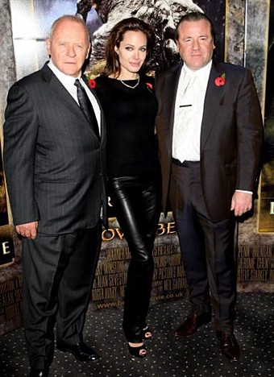

- 로버트 저메키스는 영화의 가까운 미래에는 진정 CG 그 중에서도 3D가 패션이 될 거라고 생각하나 봅니다. <백 투 더 퓨처> 시리즈를 비롯해서 <누가 로저래빗을 모함했나>, <포레스트 검프>, <컨택트>, <왓 라이즈 비니스> 등의 영화를 통해 흥미로운 CG를 꾸준히 사용해 온 그가 본격적인 모션 캡쳐 3D 영화인 <폴라 익스프레스>를 만든 건 어찌보면 당연한 결과인 것도 같아요.  

<!-- truncate -->

- <폴라 익스프레스> 때도 아이들의 눈이 섬뜩하다는 평이 있었지만 의도했든 의도하지 않았든 그런 섬뜩함은 어느 정도 이야기에 효과적으로 작용하는 요소였습니다. 후에 이미지무버스 (ImageMovers)를 통해 제작한 <몬스터 하우스>는 이러한 언캐니 벨리 이펙트에 대한 이야기를 잠재우기 위한 새로운 시도였을 거예요.  
  

‘혐오감의 계곡’ 정도로 해석이 가능한 ‘언캐니 밸리’는 일본의 로봇학자인 모리 마사히로가 지난 1970년에 발표한 이론이다. 그에 따르면 인형, 만화 캐릭터, 그림, 로봇과 같은 인공체들이 인간을 닮아갈수록 호감은 상승하지만, 인간과의 유사점이 어떤 특정한 정도(밸리: Valley)를 넘어서면 오히려 혐오감을 불러일으킨다고 한다(박스 기사 참조). 개봉 전 로버트 제메키스는 “관객은 캐릭터의 연기로부터 이전의 애니메이션 캐릭터들이 보여주지 못한 연기의 미묘함을 체감할 수 있을 것”이라고 호언장담했고, 그건 사실이었다. 실재 배우의 연기와 얼굴 동작을 디지털로 저장해 CGI 피부를 덧씌운 <폴라 익스프레스>의 디지털 액터들은 일반적인 애니메이션 캐릭터와는 달리 ‘연기’를 해냈다.  
  
[**출처 : 익스트림무비 - 로버트 제메키스와 '베오울프'**](http://extmovie.com/3933)

  
- 어쨌든 이번 영화 <베오울프> (Beowulf, 2007)의 홍보 포인트를 언캐니 벨리 이펙트로 잡은 것 역시 잘 한 것 같아요. <폴라 익스프레스> 때와 비교해보면 정말 많은 발전이 있는 것은 사실이지만 아직도 디지털 배우들의 연기 자체를 놓고 평가하기 보다는 '어색한 지점을 벗어난 장면들이 있다', '이제 곧 언캐니 벨리를 지나갈 것 같다' 등으로 포지셔닝 하는 건 현명한 겸손이죠.  
  
- 디지털 배우들의 어색한 액션이나 표정, 눈빛 등을 제외하고도 저메키스는 아직 어두운 3D 영화라는 핸디캡을 가지고 있습니다. 저메키스의 3편의 시도 - <폴라 익스프레스>, <몬스터 하우스>, <베오울프>가 모두 어두운 밤 장면을 주무대로 하고 있는 것 역시 그런 이유에서일 거예요.  
  
- 하긴, 제가 만약 아이맥스 3D DMR (Digital Re-Mastering) 상영관에서 보지 않았다면 조금 더 실망했을지도 몰라요. 하지만 종종 어색한 배우들의 연기나 표정에 대한 실망감을 훌륭한 3D가 채워줬습니다. 만약 저메키스의 <베오울프>를 보시려면 반드시 다들 3D 영화관에서 보시길!  
  
 /  /   
  
  
  
[**▶ Beowulf 홈페이지**](http://www.beowulfmovie.com/)  
[**▶ Beowulf Resticted Audiences Only 트레일러 보기 @ 유튜브**](http://www.youtube.com/watch?v=K2s5O-c4U0k)  
[**▶ Beowulf Exclusive Featurette: The Visual Look of Beowulf 보기 @ 애플 트레일러**](http://www.apple.com/trailers/paramount/beowulf/featurette/large.html)  
  
  
  

