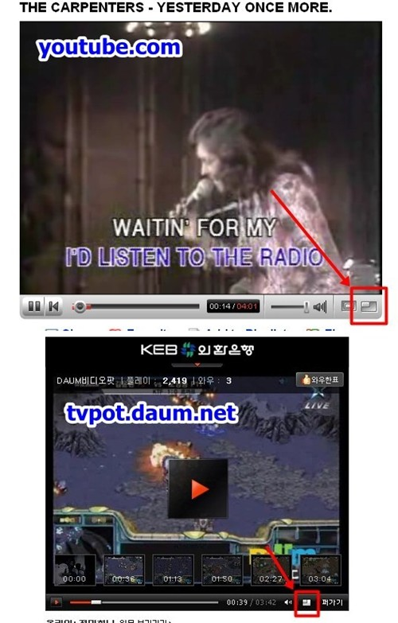

  
그냥 예전부터 봤던 건데 까먹고 있다가 그냥 한번 올리고 지나갑니다.  

<!-- truncate -->

다음 TV팟의 영상 최대화 버튼이 유튜브의 그것과 비슷하게 바뀐 게 눈에 띄였던 이유는 당시 다음의 행보가 구글의 그것을 착실히 쫒아간다는 느낌을 받았을 즈음이었기 때문이었을 거예요.  
  
이미 다음의 웹검색은 powered by 구글이고요, UCC라는 키워드로 TV팟을 강력하게 민 것도 구글이 관심을 갖고 유튜브를 인수하고 난 얼마 지나지 않은 후가 아니었나 싶고요 (확실치는 않네요 ^^), 광고도 구글 광고 (애드워즈)를 달고 있죠 (네이버는 야후의 오버추어). 또 구글의 애널리틱스와 다음의 웹인사이드, 구글의 애드센스와 다음의 애드클릭스 등 뭐 이런식으로 꾸준히 다음과 구글의 행보에서 연관성이 느껴졌었거든요.  
  
구글을 따라하든 따라하지 않든 어쨌든 요즘의 다음은 활기를 살짝 찾은 느낌이예요. 요즘 들어 초강자 네이버가 조금 주츰하는 것 같은데 앞으로는 또 어떻게 흘러갈지 지켜보는 입장에서는 재밌습니다. ^^
