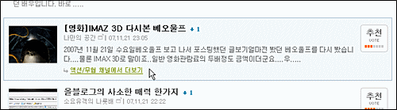
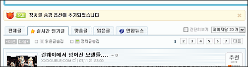

  

[**올블로그**](http://www.allblog.net/)의 글 목록에 위와 같이 마우스오버 스타일이 추가되었네요. 마우스를 시선에 맞춰 이동시키면 현재 보고 있는 글에 보다 시선을 주목시킬 수 있겠군요. 또한 마우스오버가 되었을 때 해당 글이 영화나 정치 관련 글이면 채널로 바로가기 링크가 표시됩니다.  

<!-- truncate -->

마우스오버한 글에만 효과를 주지 말고 이미 읽은 글에도 효과를 주면 어떨까요? 물론 지금도 visited link의 기본색인 자줏빛으로 표시가 되고 있긴 하지만 아예 제목과 본문을 조금 더 연한 색 (회색)으로 만든다든지 미리 보기 부분이 사라져서 좁게 보인다든지 하는 식으로요.  
  
  

이보다 전에 추가된 정치글 숨김 옵션의 경우도 재치있었어요. 물론 클릭은 셀프죠. ^^
