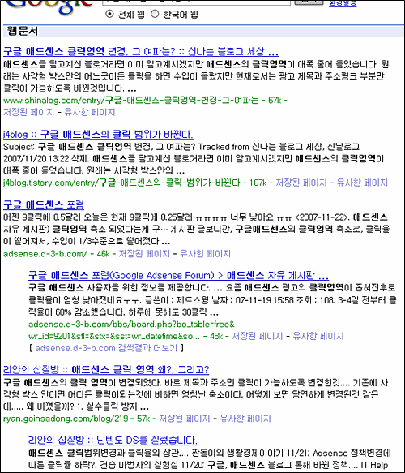
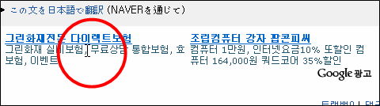
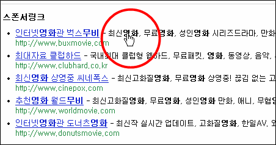
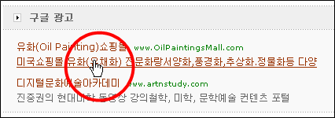
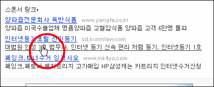
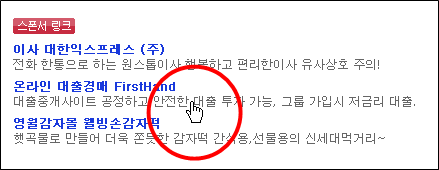
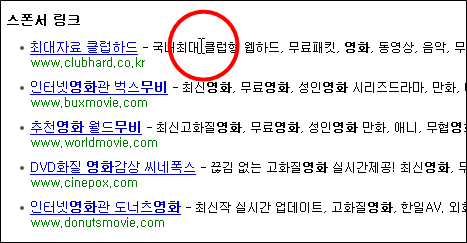

구글의 광고모델인 애드센스(adsense)의 클릭영역이 축소되어서 여기저기서 말들이 많습니다.  

<!-- truncate -->

  

구글에서 [**구글 애드센스 클릭영역**](http://www.google.co.kr/search?q=%EA%B5%AC%EA%B8%80%20%EC%95%A0%EB%93%9C%EC%84%BC%EC%8A%A4%20%ED%81%B4%EB%A6%AD%EC%98%81%EC%97%AD&hl=ko&lr=)으로 검색한 결과  
예전에는 광고영역 전체가 클릭 가능했는데, 변경된 이후로는 광고 제목과 표시 URL 부분만 클릭이 되고 광고 내용은 표시가 안되기 때문에 클릭율이 엄청 낮아졌기 때문이겠죠.  
  
저도 애드센스를 달고 있지만 생각해보면 구글이 나름대로 합리적인 조치를 취했다고 생각해요. 품질을 관리하는 거죠. 애드센스를 달고 있는 블로거나 사이트의 입장에서 보자면 불만족스럽겠지만 장기적으로 보자면 광고주들의 신임을 받을 수 있기 때문에 윈윈이 될 것 같고요.  
  
하지만 구글의 모든 애드센스 광고의 클릭영역이 축소된 건 아닌 것 같습니다. 일단은 개인 게시자부터 시작되는 것 같아요. 컨텐츠 네트워크로 묶인 업체들의 경우 대부분 그대로 있더군요. 그래서, 한번 확인해 봤어요.  
  
구글 광고를 달고 있는 여러 사이트를 돌아다니며 광고 내용에 마우스를 올려놓고 캡쳐해 봤습니다.  
  
  

위에서 언급했듯이 개인 블로그인 제 사이트에서는  
광고 내용에는 클릭이 안됩니다.  
  
  

하지만, 다음(DAUM)에서는 클릭이 됩니다.  
  
  

한겨레 사이트도 클릭이 되고요,  
  
  

조선일보도 됩니다.  
  
  

디시인사이드도 되죠.  
  
  

앗. 그런데, 엠파스는 안되네요?  
얘네는 컨텐츠 네트워크에 포함이 안된 건가… -\_-a  
페이지뷰 단위가 센 기업들의 이익은 여전히 보장해주면서 상대적으로 검증이 덜 된 개인 블로그나 소규모 사이트에서만 품질을 관리하는 전략인 걸까요? 저 기업들은 또 다시 애드워즈의 광고주로 참여할 가능성도 있기 때문에 저런 방식을 택했다고도 생각할 수도 있고, 소규모 사이트와는 클릭의 패턴도 다를 것 같다는 생각도 들고요.   
  
어쨌든 이제 구글 애드센스에 대한 거품이 좀 꺼질까요? 아니면 수익성 강화를 위해 애드센서들의 극성이 더 심해질까요? 궁금해지는군요.
