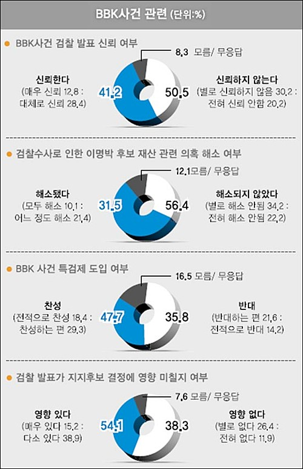

  

<!-- truncate -->

어느 신문 기사 중에 삽입되었던 그래프라고 해요.  
  
자세히 보면 그래프에서 한 항목이 차지하는 비율과 그 크기가 전혀 맞지 않습니다.  
  
첫번째 항목을 예로 들어보죠.  
  

**BBK사건 검찰 발표 신뢰 여부**  
  
**신뢰한다 : 신뢰하지 않는다 = 41.2% : 50.5%**

  
분명 **신뢰하지 않는다**의 비율이 더 높은데 (과반수를 넘죠) 그래프는 **신뢰한다** 쪽이 더 크군요. 게다가 신뢰하지 않는다는 무려 과반수잖아요.  
  
두번째 항목까지만 예로 들어볼까요?  
  

**검찰수사로 인한 이명박 후보 재산 관련 의혹 해소 여부**  
  
**해소됐다 : 해소되지 않았다 = 31.5% : 56.4%**

  
이건 뭐 엄청난 차이의 비율인데, **그래프는 정반대의 비율로 그려져있군요.** 그냥 언뜻 보면 해소됐다고 여기는 사람들 숫자가 절반 이상은 되는 것 같아요.  
  
다른 항목들도 자세히 보면 다 마찬가지입니다.  
  
이쯤되면 정말 막 나간다고 할 수 있는 것 같아요. 정말 우리나라에는 위대하신 수령 동지 이명박만이 희망인 걸까요?  
  

**추가**  
  
[**▶ 기사 캡쳐화면 보러가기**](http://img.todaystory.net/talk.php?img_no=48731)  
[**▶ 실제 기사 보러가기**](http://news.hankooki.com/lpage/politics/200712/h2007120618534321060.htm)
