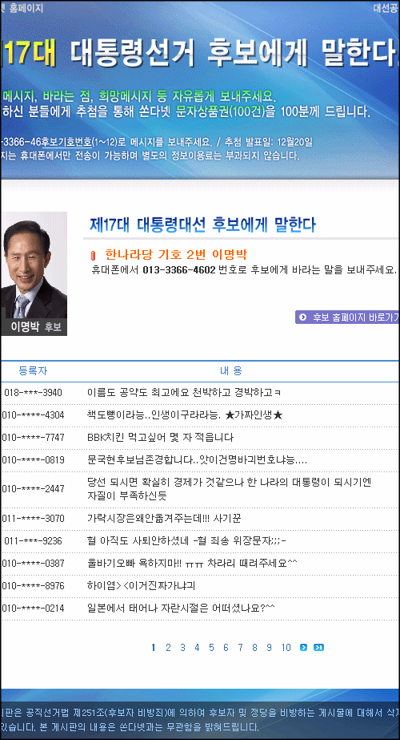

[**클라리온님의 블로그**](http://blog.naver.com/nuitzini/)에서 [**'쏜다넷' 대선후보에게 문자보내기**](http://blog.naver.com/nuitzini/60045268658) 이라는 글을 보고 재밌어서 저도 남깁니다.  

<!-- truncate -->

간단하게 말하면 [**쏜다넷**](http://www.xonda.net/)에서 [**제17대 대통령선거 후보에게 말한다!**](http://www.xonda.net/hope2007/) 라는 이벤트를 하고 있습니다. 정해진 번호로 문자를 보내면 각 후보에게 메시지가 전달되는 이벤트이며 비용은 무료라고 해요.  
  
그 중에 이명박 후보에게 온 최근 문자 목록을 보고 웃겨서-\_- 글 남깁니다. 요약, 발췌 이런 게 아니라 제가 들어가서 봤을 때 가장 최근에 온 문자들입니다.   
  
인터넷에서는, 젊은 층에서는 아무래도 인기가 없지요. 문득 40%가 넘는 지지율도 위장 지지율이 아닌가 하는 생각이;;;  
  

