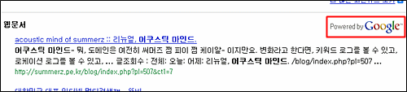
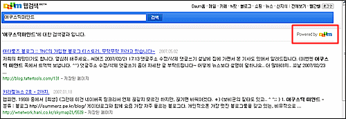

Mozilla/4.0 (compatible; DAUMOA-video; +http://ws.daum.net/aboutkr.html)

<!-- truncate -->

  

222.231.42.187  
211.233.79.165  
211.233.79.178  
211.233.79.168  
222.231.42.203  
222.231.42.188  
222.231.42.198  
222.231.42.190  
.  
.  
.

  
다음은 예전부터 구글의 검색엔진을 사용하고 있는 거 아니었나요?  
  
  
Powered by Google 이 된지 좀 됐잖아요.  
그런데, 이제 슬슬 구글 검색엔진을 떼어버리려고 하는가 보군요. (혹시 계약기간 만료 뭐 이런 건가요?) 그래도 그렇지 오래 쉰 건 알겠지만 갑자기 막 긁어대니 놀랐잖아요;;;  
  
그나저나 오오- 헤더에 적혀있는 DAUMOA-**video**. 혹시 동영상 검색과 관련된 건가요? ;;;  
  
  
  
  
아직 워밍업 중인가요? 제 블로그 이름을 쳐도 다른 주소부터 나오네요;;;
