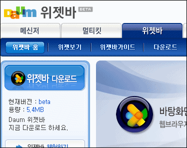
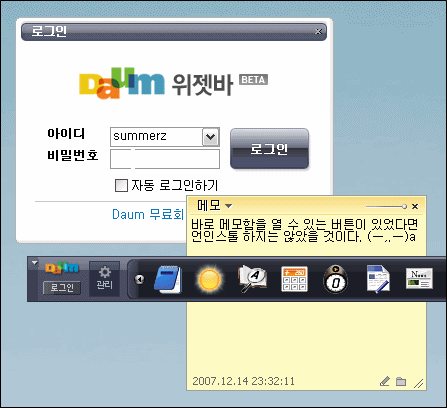
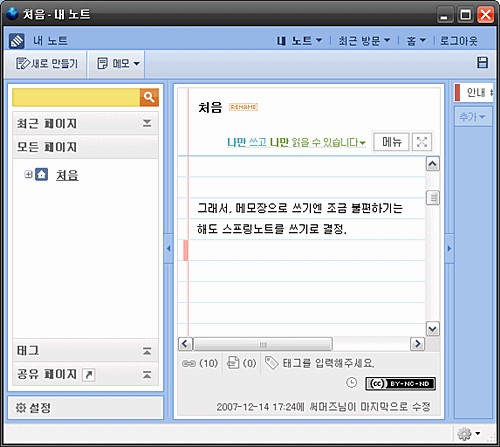

한동안 어떤 PC에서든 간단하게 메모를 하면 다른 PC에 가서도 그 메모를 열어 볼 수 있는 기능이 있는 메모장을 찾다가 하나를 결정했었습니다. 바로 다음 위젯바의 메모 위젯이죠.  

<!-- truncate -->

  
[다음 위젯바 베타](http://widget.daum.net/)  
원래는 메모 기능만 필요했지만 뭐, 프로그램 특성상 다른 게 다 딸려오는 건 어떻게 할 수 없는 거니까요. 사실 크게 불편하지도 않았어요. 컴퓨터가 크게 버벅거리지도 않았고요.  
  
하지만, 쓰다 쓰다 결국엔 언인스톨 해버렸습니다. 이유는 메모함을 바로 선택하는 기능이 없었기 때문이죠.  
  
메모 위젯 버튼을 누르면 새 메모가 뜨고, 메모함을 열려면 어쨌든 새 메모를 한 개 만든 다음에 조그만 메모함 버튼을 클릭해야 합니다. 별거 아닌 거 같지만 이런 동작이 참 불편하더군요.  
  
  
생각보다 불편했어요.  
그래서, 다른 의미로 덩치는 조금 크더라도 [**스프링노트**](http://springnote.com/)를 사용하기로 했죠. 브라우저 하나를 띄워놓고 있는 게 크기면에서 좀 불편하긴 했지만, 기왕 불편해진 김에 기능이라도 강력한 걸 사용하자는 심산인 거죠.  
  
  
(메모리상으로는 결국 같은 거겠지만) [**모질라의 프리즘**](http://labs.mozilla.com/2007/10/prism/)을 사용해서 브라우저의 느낌을 지우고 나니 그럭저럭 괜찮더라고요. 간단한 css도 지원을 하니까 메모할 때도 편해요.  
  
이렇게 한참 쓰면서 느낀 건데요, 이렇게 작은 위젯 등으로 이용하는 사람들을 위한 간단 버전의 레이아웃이 하나 정도 있는 것도 좋지 않을까 하는 생각이 들었습니다. ^^)  
  

**관련 링크**  
  
[▶ 스프링노트](http://springnote.com/)  
[▶ Mozilla Labs Blog - Prism](http://labs.mozilla.com/2007/10/prism/)  
[▶ 우공이산 - 웹서비스를 데스크톱으로! 모질라 '프리즘'](http://asadal.bloter.net/tt/asadal/622)  
[▶ THIRDTYPE'S NETWORK - Prism을 활용한 미투데이 접속](http://www.thirdtype.net/1403)
