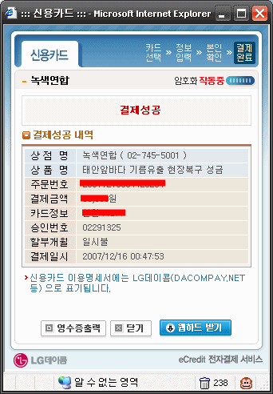
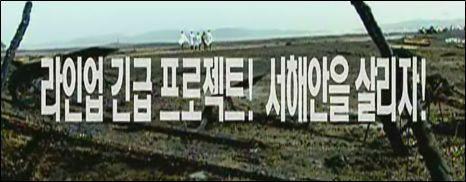
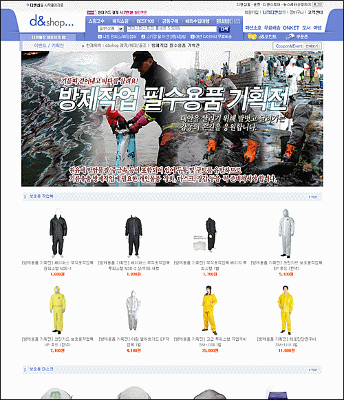
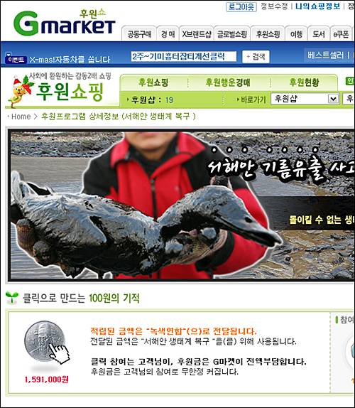

  
미약하지만 저도 보탰습니다.  

<!-- truncate -->

  
[**SBS 라인업**](http://tv.sbs.co.kr/lineup/)도 돕고 - 어쩌니 저쩌니 해도 저렇게 가서 돕는 거라면 좋은 일인 것 같아요.  
  
  
[**마린블루스**](http://marineblues.net/)도 돕고.  
  
  
[**다음 디앤샵**](http://www.dnshop.com/html/event/eventF067_20071212170603.html?Sid=0103_P1030000_01_00)도 돕고.  
  
  
[**지마켓**](http://www.gmarket.co.kr/challenge/neo_assist_center/100won_miracle.asp)도 돕고.  
  
그리고, 무엇보다 수많은 자원봉사자분들이 돕고 계시겠지요. 다들 힘내세요.  
  

**관련 링크**  
  
[▶ 행.복.한.자.유.인 - 태안 기름유출사고와 그럴듯한 음모론](http://jumpkarma.com/952)  
[▶ cinemarx의 글 공장 - 사회봉사와 책임소재의 은폐 - 삼성중공업 기름유출 사건](http://link.allblog.net/7062687/http://cinemarx.cafe24.com/tt2/205)  
[▶ 쏭군은 열정 드리머 - 태안 기름 유출사고, 입을 닫고 있는 것만이 답은 아닙니다](http://monoeyes.com/464)  
  
이렇게 신기할 정도로 **삼성** 두 글자가 모든 방송, 신문기사에 쏙 빠져있다니, 이 정도쯤 되면 음모론이라고 부르는 게 이상하지 않아요.
