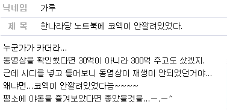

**2007.12.23.** **"수에즈 유조선 좌초 사고"에 국내 언론 "이상한 침묵"**  
세계 주요외신들이 이처럼 긴급 타전한 ['수에즈 운하 유조선 좌초 사건'](http://afp.google.com/article/ALeqM5jG7PK4iaJFpxPIuUOWYdehAr7v1Q)에 대해 21일 오후 4시가 되도록 국내 대부분의 언론들이 보도하지 않고 있다. 심지어 일부 국내 매체에서는 이 외신이 21일 국제뉴스 속보로 올랐다가 갑자기 사라지기도 했다. / 이명박 당선자가 경부운하 건설 계획에 강한 집착을 보이고 있는 사정을 감안해 알아서 '자율 보도 통제'를 하고 있다는 강한 의혹이 들지 않을 수 없는 상황이다. 비슷한 예: **삼성중공업 기름유출 사고**도 **태안 기름유출 사고**로 불리우고 있다. 이번 기름유출 사고에서 삼성이라는 두 글자는 신문에서도, TV에서도 찾아보기가 힘들다.  

<!-- truncate -->

[▶ 기사보기](http://www.pressian.com/scripts/section/article.asp?article_num=40071221160701)

  

**2007.12.20.** **“지하철 운행 때 패트병 들고 타요”예견된 승무원 참변**  
승무원들은 갑작스런 생리현상을 해결하지 못하다 자칫 사고로 이어질 수 있기 때문에 간이화장실 설치 등이 필요하다고 입을 모으고 있다. 기관사 명준영(45)씨는 “성북역과 병천역을 오가는 지하철 1호선 기관사들은 4시간 넘게 화장실에 갈 수 없다”며 “승차하기 전에 용변을 보는 게 일상화돼 있지만 갑자기 배탈이 나면 속수무책”이라고 호소했다. 서울메트로 노조 박흥규 법규부장은 “기관실 혹은 승강장 끄트머리에 간이화장실을 만들어줘야 한다”면서 “화장실 문제는 인권 문제”라고 지적했다. 사람답게 일하는 건 아직도 요원한 세상. 게다가 공기업이라는 게 더 끔찍;;;;  
  
[▶ 기사보기](http://www.kukinews.com/news/article/view.asp?page=1&gCode=soc&arcid=0920747015&cp=nv)

  

**2007.12.18.** **승리의 곰플, 승리의 KMP! (한나라당을 위한 코덱 강의)**  
  
이미지 출처 : [traces of slow time](http://slowtime.dnip.net/slowtime/130)  
원문 출처 : [디시인사이드 2007 대선갤러리](http://gall.dcinside.com/list.php?id=2007daesun&no=144960)  
이병박이 본인 입으로 BBK라는 투자자문회사를 설립했다는 말을 하는 동영상을 한나라당에 팔아먹으려다 잡혔는데도 그 동영상이 그대로 공개된 이유. ... 그럴싸 한데?  
  
[▶ 보러가기](http://slowtime.dnip.net/slowtime/130)

  

**2007.12.17.** **원하는 소리를 레이저처럼 쏜다**  
김 교수는 “이 이론은 스피커 간 소리간섭 현상을 활용한 것으로 수학적으로도 입증 가능하다”며 “이미 영국 연구진이 우리의 이론을 바탕으로 비행기 좌석에 적용되는 개인용 스피커 시스템을 선보였다”고 말했다. 지하철 3호선 고속터미널역의 센트럴시티 안에 이런 방식으로 소리를 쏘는 공간이 있다. 오오- 아이디어 넘치는 공간 디자인인데? 라는 생각이 절로;  
  
[▶ 기사보기](http://news.media.daum.net/digital/science/200712/13/chosun/v19225680.html?_RIGHT_COMM=R8)
