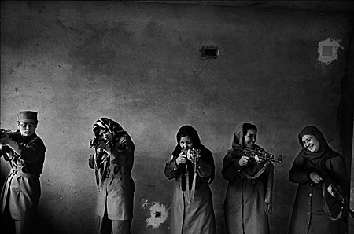

**2007.12.30.** **규제 때문에 투자 않고 일자리 안 늘어났나?**  
매일경제는 "기업 승계에 대한 부정적 인식을 바꾸는 것이 시급하다"고 주장한다. 매일경제는 "재산이 아니라 기업을 물려줄 때도 똑같은 세금 부담을 져야 한다는 것이 기업가 정신을 약화시킬 수 있는 아킬레스 건으로 작용하고 있다"는 황당무계한 논리를 편다. 상속세와 증여세를 폐지해 달라는 이야기다. / 기업 창업자들의 후계 상속을 돕는 것과 기업 투자를 활성화하는 것, 일자리를 창출하는 것은 도대체 무슨 상관관계가 있을까. 매일경제는 심지어 "상속·증여세 때문에 가업을 승계하는 대신 폐업을 선택하는 바람에 기업의 평균 수명이 10.6년에 불과하다는 통계도 있다"는 이해할 수 없는 주장을 펴기도 한다. '수령 동지 만만세!'를 외치면 너무 노골적이라 안하는 거지?  

<!-- truncate -->

[▶ 기사보기](http://www.mediatoday.co.kr/news/articleView.html?idxno=63764)

  

**2007.12.25.** **타임지의 2007년 올해의 사진들 (The Year in Images)**  
  
총 48장이 선정되었다. 그 사진은 그 중 한 장. 출처는 당연히 [타임지](http://www.time.com/time/photogallery/0,29307,1695460,00.html).  
[▶ 보러가기](http://www.time.com/time/photogallery/0,29307,1695460,00.html)

  

**2007.12.24.** **아마존닷컴의 전자책단말기 킨들 (Kindle) 동영상**  
  
어쨌든 흐름을 탄 건 사실이다. 앞으로도 계속 발전하겠지.  
  
[▶ 보러가기](http://www.youtube.com/watch?v=BKUKQ7QqOHw)
