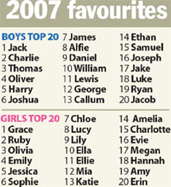

**2008.1.27.** **영국인이 좋아하는 아기 이름은?**  
  
여자아이의 이름으로 가장 각광을 받은 것은 그레이스였다. 모나코 왕비였던 작고한 여배우 그레이스 켈리를 떠올리는 이름이다. 다음으로는 루비, 엘라, 에비처럼 요즘 이름과는 다소 동떨어진 고상한 이름이 여자아이 이름으로 인기를 끌었다. / 남자아이 이름으로는 잭이 올해에도 벌써 13년째 부동의 1위를 지켰다. 올리버, 토머스, 조슈아, 제임스도 여전히 인기였다. 이같은 내용은 올해 영국에서 태어난 38만명의 호적에 오른 아기 이름을 토대로 육아클럽 바운티가 조사했다. 올디스 벗 구디스. 하지만 한국에서 철수, 영희는 그리 인기있는 이름은 아니지, 아마?  

<!-- truncate -->

[▶ 기사보기](http://eknews.net/bbs/zboard.php?id=UK&page=1&sn1=&divpage=1&sn=off&ss=on&sc=on&select_arrange=headnum&desc=asc&no=1543)

  

**2008.1.26.** **사르코지 뽑은 프랑스 대선 84% … 의무투표 호주·벨기에 90% 넘어**  
의무투표제를 실시하는 나라도 적지 않다. 호주.벨기에를 비롯, 중남미의 아르헨티나.브라질.에콰도르 등 30여 개국은 유권자가 투표에 참여하지 않을 경우 불이익을 준다. 벨기에에서는 투표에 불참하면 누적 횟수에 따라 일정액의 벌금을 내야 하며, 경우에 따라서는 선거권이나 공직 진출에 제한을 받을 수도 있다. 투표를 의무화한 것은 선거에 의해 구성되는 정부가 국민 다수의 의견을 대변하도록 하기 위해서다. / 이런 나라들의 투표율은 대체로 90%를 웃돈다. 지난달 24일 치러진 호주 총선의 투표율은 94.76%에 달했다. 벨기에의 6월 총선 투표율도 91.0%를 기록했다. 당연히, 강제하는 게 좋은 것만은 아니다. 반대로 투표하는 사람들에게 혜택을 주는 쪽으로 생각해보면 어떨까.  
  
[▶ 기사보기](http://news.media.daum.net/politics/others/200712/19/joins/v19307792.html)

  

**2008.1.23.** **히스 레저, 숨진 채 발견…경찰 "약물 과용 가능성 있어"**  
영화 '브로크백 마운틴'으로 잘 알려진 영화배우 히스 레저(28)가 22일(현지시각) 자신의 뉴욕 아파트에서 숨진 채 발견돼 충격을 주고 있는 가운데, 젊고 유망한 스타의 사인을 둘러싼 여러 가지 가능성이 제기되고 있다. 씁쓸하다.  
  
[▶ 기사보기](http://www.cbs.co.kr/nocut/show.asp?idx=730186)

  

**2008.1.22.** **무한도전 반장선거 묘한 풍자극**  
사실 몇년전까지만해도 3金이나 노대통령등등의 정치풍자개그가 많이있었습니다. 엄용수씨나 김형곤씨등의 원로 개그맨부터 김학도씨나 배칠수씨등의 비교적 젊은 개그맨까지. 하지만 요즘은 폭소클럽등의 한두코너를 제외하고는 별다른 정치풍자가 없는것 같습니다. 블로그에 글 쓰는 것도 선거법 위반으로 고발하는 나라, 1970년대도 1980년도 아닌 자그마치 21세기의 대한민국. 정치 풍자 코미디가 나올 턱이 있나.  
  
[▶ 보러가기](http://breathe77777.tistory.com/183)

  

**2008.1.14.** **블로그를 통해 물건 판매 후 결제 - INIP2P**  
블로그를 통해 판매자와 소비자를 연결시켜 준다고 하는데, 실제로 무언가를 판매하는 형태로 돈이 왔다갔다 한다. 많이 아쉽다. 그냥 단순히 돈을 지급하는 형태로 만들면 좀 더 유연한 서비스 모델이 되지 않았을까?  
  
[▶ 보러가기](http://www.inip2p.com/)

  
지난 2주 동안 바빠서 이번에는 2주치를 몰아서.
