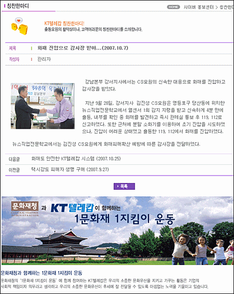

**2008.2.16.** **"한국인질 석방 몸값은 400만달러였다"<뉴스위크>**  
지난해 8월 아프가니스탄에서 탈레반 반군에 납치됐던 한국인 인질 21명의 석방을 위해 한국 정부가 400만 달러의 몸값을 건넸다는 주장이 제기됐다고 미 시사주간지 뉴스위크 인터넷판이 6일 보도했다. / 뉴스위크에 따르면 '탈레반 고위 지도자'라는 우스타드 야시르가 최근 파키스탄 파슈툰계 잡지 '아파크'(Afaq)와의 인터뷰에서 "아무 대가 없이 그들을 석방하려 했다면 (인질을 잡는 행위는) 아무 가치도 없었을 것"이라며 몸값이 오갔음을 시사했다. / 야시르는 "그들을 석방하는 가장 좋은 방법은 몸값이었다"라고 덧붙였다. 한국 사람은 걸어다니는 돈뭉치. 오- 할렐루야! 우리 민족이 사실은 이렇게 비싼 민족이었다니. 국가 경쟁력 향상에 불철주야 노력해주신 그 분들께 감사…를.  

<!-- truncate -->

[▶ 기사보기](http://kr.news.yahoo.com/service/news/shellview.htm?linkid=486&articleid=2008021008372719101&newssetid=1270)

  

**2008.2.14.** **"광화문 연가" 작곡 이영훈씨 별세 ‥ 이문세와 명콤비**  
국내 대중음악계 팝 발라드 장르를 개척한 인물로 꼽히는 이영훈은 1983년 연극음악으로 출발,1986년 이문세 3집 '난 아직 모르잖아요'를 시작으로 '사랑이 지나가면''이별 이야기''가로수 그늘 아래 서면''옛사랑' 등 2001년 이문세의 13집까지 함께 하며 수많은 히트곡을 발표했다. 한 시대를 풍미한 작곡가. 노래는 영원히 남아있을테니… 잘 가세요.  
  
[▶ 기사보기](http://news.media.daum.net/entertain/broadcast/200802/14/hankyung/v19969314.html)

  

**2008.2.14.** **This is LOVE 연아양 나이키 광고**  
비장미 넘치는 국민은행이나 생수 광고보다 훨씬 좋다! 조금만 잘나면 국가의 대표로 만들어버리는 마케팅은 나도 싫다.  
  
  
[▶ 보러가기](http://www.lazylogs.net/226)

  

**2008.2.13.** **♬이러다 이경숙 1집 나오겠다**  
작성일시 2008.02.13. 12:23  
  
아이디 kyonja11  
  
1. 어긋난 오해  
2. Don't Let Me Be Misunderstood (주호의 테마)  
3. 날 오해해도 좋아 (경숙의 테마)  
4. 오해공감 (feat. 조중동)  
5. 혼자만의 오해  
6. 오해와 진실에 관한 詩  
7. 오해 - 옥신각신 (feat. 금실누나)  
8. 오해라구 하지만  
  
  
# Bonus Track.  
9. 오해피데이 (feat. MB, 영어학원장)  
10. 각오해 (부제: 그날 이후로 5년)  
  
물론 원곡 가수분들께는 죄송한 마음뿐이다.   
  
네이버의 아햏햏한 주소 방식 때문에 링크가 안걸린다. 글 쓰신 분, 멋지다.  
  
[▶ 이 글이 있는 글 목록으로 가기](http://news.naver.com/hotissue/ranking_read.php?section_id=100&ranking_type=popular_day&office_id=008&article_id=0001944178&date=20080213&seq=1&m_view=1&m_url=%2Flist.nhn%3Fgno%3Dnews008%2C0001944178)

  

**2008.2.11.** **기초 부실한 ‘문화 상품화’가 재앙 불렀다**  
숭례문의 경우도 수문장 교대식 행사에 연간 17억원의 예산을 쓰는 반면, 설치된 소방방재 도구는 소화기 8대와 상수도 소화전이 전부였다. 숭례문을 관리하는 건 기초자치단체인 서울 중구청의 녹지공원과 직원 세 명이 전부였고, 그나마 저녁 8시~오전 10시 사이 야간 경비는 민간업체의 무인경비에 의존해 왔다. 문화재청과 중구청 어느 기관도 숭례문의 보험조차 들지 않은 상태였다. 흥부가 기가막혀 흥부가 기가막혀 흥부가 기가막혀 ㅠ.ㅠ  
  
  
[▶ 기사보기](http://www.hani.co.kr/arti/society/society_general/268871.html)
