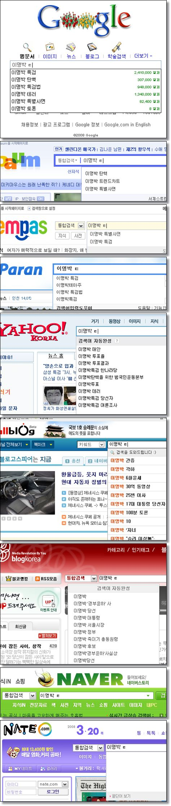

포털의 자동완성 기능을 한번 사용해봤습니다.  

<!-- truncate -->

검색어는 **이명박 ㅌ**  
  
네이버와 네이트만 아무 결과가 나타나지 않는군요. "네이버와 네이트"라고 묶으면 그럴 듯 하다고 할 분들이 많을 것 같은데, 재밌는 결과입니다.  
  
검색엔진은 사람이 아니기 때문에 자음까지만 보고 무슨 단어일지 **추측**하는 게 아니라 많은 사람들이 관심있어 하는 정보를 **통계**를 통해 보여주는 건데, 도통 네이버와 네이트는 아무 것도 보여주질 않는군요.  
  
그나저나 많은 분들이 그 분의 이름과 더불어 탄핵, 특검, 테러에 대한 정보를 원하시는군요. ㄷㄷㄷ  
  
[+] 올블로그와 블로그 코리아의 결과는 보너스로 넣었기도 하지만 정확히 보자면 **이명박 ㅌ**의 결과가 아니라 **이명박**의 결과입니다.  
  

