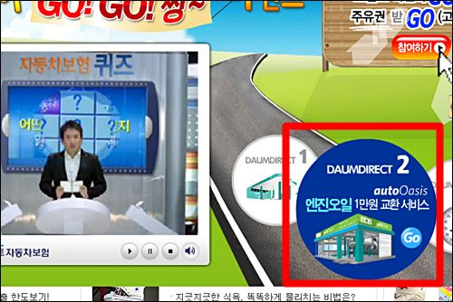
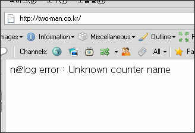

파이어폭스 2.0.0.13 로  

<!-- truncate -->

  
  
다음(DAUM)에 걸린 다음다이렉트보험 광고 중 가운데 링크를 클릭했더니  
  
  
  
이와 같은 링크로 떨어진다.  
  
아무리 여러 번을 시도해 봐도 똑같은 결과.  
  
  
몇 번 해보다가 문득 든 생각,  
  
**'저 광고주는 도대체 얼마를 손해봤을까.'**  
  
  
  
p.s. 인터넷 익스플로러 6.x / 7 으로는 이상이 없다.
