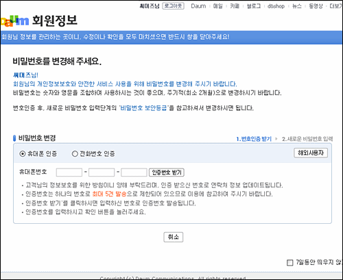
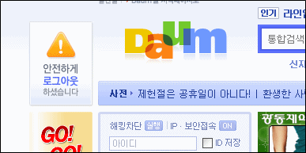

> 포털사이트 다음[035720]이 지난해 고객상담 시스템을 해킹당하고도 이를 수개월간 숨겨온 사실이 뒤늦게 드러났다.  
>   
> 26일 다음커뮤니케이션과 경찰에 따르면 포털사이트 다음의 고객상담 관리 시스템을 지난해 7월께 전문 해커 A씨에게 해킹당했다.  
>   
> (중략)  
>   
> 그러나 다음은 해커의 접근으로 개인정보 유출 가능성이 컸음에도 전체적인 공지 등을 통해 이용자들의 피해를 최소화하는 조치를 충분히 취하지 않고 피해 사실을 8개월여간 숨겨왔다.  
>   
> 다음은 대신 피해 가능성이 있는 회원들에게 이메일 등을 통해 아이디와 비밀번호를 강제로 바꾸도록 하는 선에서 사건을 마무리지었다.  
>   
> (중략)  
>   
> 한 업계 관계자는 "피해가 일부 이용자에 국한된다 하더라도 개인정보 유출 여부나 피해 규모 등을 특정하기 어려웠던 상황인 만큼 이용자 전체를 대상으로 공식적인 사과와 함께 아이디, 비밀번호 변경 등의 조치를 취하게 했어야 했다"고 꼬집었다.  
>   
> 이에 대해 다음 측은 "당시 피해 가능성이 조금이라도 있는 이용자들에게는 개인적으로 고지해 피해를 최소화했다"며 "회원정보 데이터베이스는 안전해 다른 이용자들의 피해는 전혀 없었다"고 해명했다.  
>   
> 출처 : [**연합뉴스 <다음, 상담시스템 해킹당하고 수개월간 `쉬쉬'>**](http://www.yonhapnews.co.kr/economy/2008/03/26/0301000000AKR20080325204051006.HTML)

<!-- truncate -->

  
아침에 다음 투데이 익스퍼트를 보다가 알게 된 기사.  
  
다음 (DAUM), 이건 좀 심한 거 아닌가요?  
  
최근 옥션이랑 너무 비교되잖아요.  
  
**추가**  
  
  
  
아, 그래서 계속 이 화면이 나왔던 거군요. -\_-;  
  
**추가 2**  
  
  

이런 것도 나오고 말이죠.
