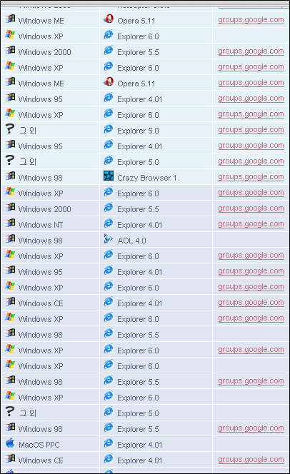

  
엄밀히 말하면 기묘한 리퍼러는 아니다.  

<!-- truncate -->

다만 구글 그룹스 (Google Groups) 서비스도 스패머들의 도구로 사용되기 시작했다는 걸 알았을 뿐.  
  
인터넷의 모든 기술은 스패머의 도구가 되는 것일까?  
  
현재 이 블로그로 들어오는 스팸 구글 그룹스 리퍼러는 대부분 http://groups.google.com/group/casino\_ ... 들이다. 조만간 각종 론과 다이어트, 제약 관련 주소들도 들어오겠지? -\_-;
