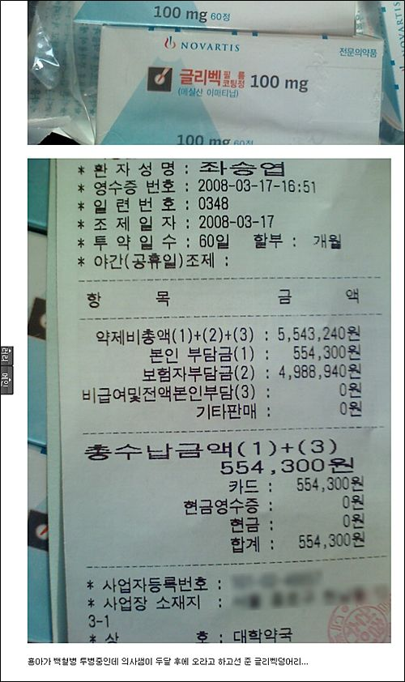
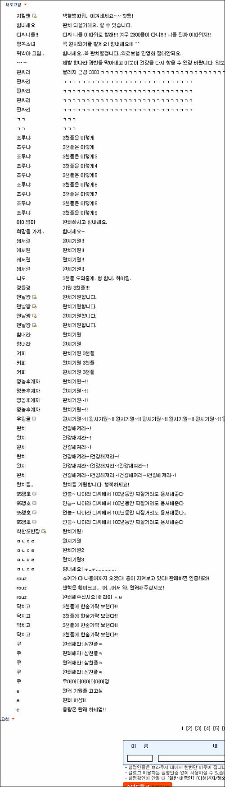

디씨폐인들은 욕도 많이 먹고, 영향도 많이 끼치고, 정말 수많은 목소리를 내는 커다란 집단이다. 네이버가 양지에서 유명세를 떨치며 거들먹거리고 있다면 디시인사이드는 음지에서 게릴라를 양산한다고나 할까?  

<!-- truncate -->

각설하고,  
그냥 한밤 중에 [**디씨를 보다가**](http://gall.dcinside.com/list.php?id=hit&no=5766&page=2) 울컥해서 남김.  
  
간단하게 설명하면 디씨의 한 횽이 백혈병 투병 중에 550만원어치 약을 탄 걸 인증한 글에 찌질이들 집합소 디씨폐인들이 하나 같이 백혈병 따위, 완치기원, 한숟가락 보탠다, 완쾌하삼, 완쾌하면 인증하라...며 댓글들을 달고 있었다. 현재 2,373개의 리플들이 달려있다.  
  
  
  

인증샷을 보면 본인 부담금은 10% 이며, 리플 단 어느 횽 말에 의하면 글리벡은 그나마 그 10%도 환급받을 수도 있다고 한다. (사실여부는 모름)  
  
2mb는 국민들의 각종 질병 정보를 삼성생명 같은 민간보험회사에 넘긴다고 스스로 빛을 내고 있고 (라고 쓰고 'xx 발광하고 있고'라고 읽는다), 요즘 청년실업을 포함한 자발적 실업자가 300만명에 이른다고 하고, 요즘의 젊은 세대를 비유하는 말이 88만원 세대라고 하는 날들에 찌질이들 양성소 및 집합소라 불리는 디씨에서 저런 쓰레드를 보니 좀 울컥하다.  
  
  
  
그러게... 밤은 밤인가 보다. 새벽은 언제나 올까.  
  
  
  
조용한 밤에 이런 글을 보니 문득 이 시가 생각난다.  
  

세상이 달라졌다.  
  
정희성  
  
저항은 영원히 우리들의 몫인 줄 알았는데  
이제는 가진 자들이 저항을 하고 있다  
세상이 달라졌다  
저항은 어떤 이들에겐 밥이 되었고  
또 어떤 사람에게는 권력이 되었지만  
우리 같은 얼간이들은 저항마저 빼앗겼다  
세상은 확실히 달라졌다  
이제는 벗들도 말수가 적어졌고  
개들이 뼈다귀를 물고 나무 그늘로 사라진  
뜨거운 여름 한때처럼  
세상은 한결 고요해졌다  
  
  
  
세상이 달라졌다  
  
안치환  
  
세상이 달라져 세상이 달라져  
저항은 영원히 우리들의 몫인 줄 알았는데 몫인 줄 알았는데  
이제는 다 가진 자들이 저항을 하고 있어  
  
세상이 달라져 세상이 달라져  
저항은 어떤 이들에겐 배부른 밥이 되고 권력이 되었지만  
우리 같은 얼간이들은 저항마저 빼았겼어  
  
세상은 확실히 달라졌어 세상은 확실히 달라졌어  
이제는 벗들도 말수가 적어지고  
개들이 뼈다귀를 물고 나무 그늘로 사라진  
뜨거운 여름날의 한때처럼  
세상은 한결 고요해졌어  
  
세상이 달라져 세상이 달라져  
저항은 어떤 이들에겐 배부른 밥이 되고 권력이 되었지만  
우리 같은 얼간이들은 저항마저 빼앗겼어  
  
세상은 확실히 달라졌어 세상은 확실히 달라졌어  
이제는 벗들도 말수가 적어지고  
개들이 뼈다귀를 물고 나무 그늘로 사라진  
뜨거운 여름날의 한때처럼  
세상은 한결 고요해졌어

  
한줄요약 : 그래도, 찌질거려도 살아야 한다. 승엽이횽 힘내3.
