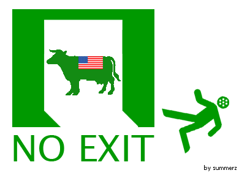

[MBC PD수첩](http://www.imbc.com/broad/tv/culture/pd/)의 [긴급취재! 미국산 쇠고기, 과연 광우병에서 안전한가?](http://www.imbc.com/cms/CUCNT240/TV0000000073991.html) 를 보며 떠오른 생각.  

<!-- truncate -->

오! 마이 갓!  
  
  
  
  
[**Lenny kravitz - Circus**](http://www.youtube.com/watch?v=ykH2VoRv7cI)  
  
Welcome to the real world  
You better be strong  
Never know which way to go  
It might end up wrong  
So you better be strong  
  
축하해, 이제부터가 진짜야  
강해지는 게 좋을 거야  
어디로 가야할지 모르거든  
결국 잘못될지도 몰라  
그러니, 강해지는 게 좋을 거야
