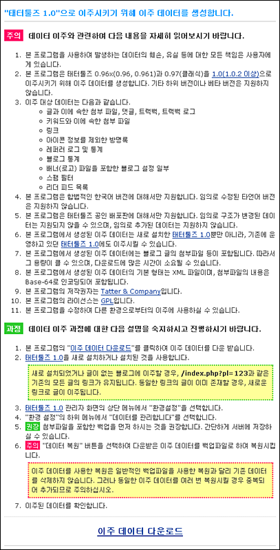
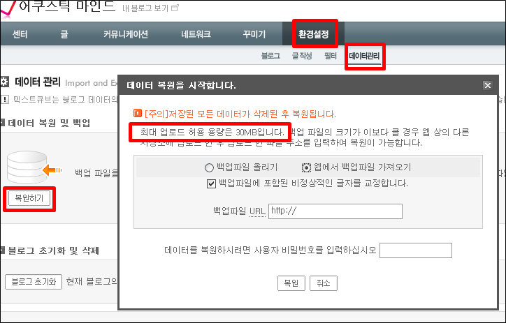
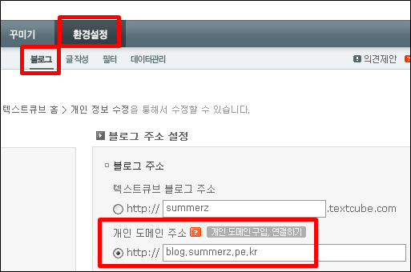
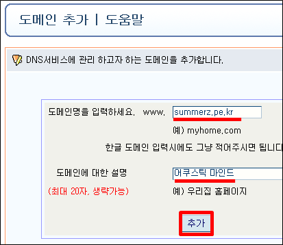
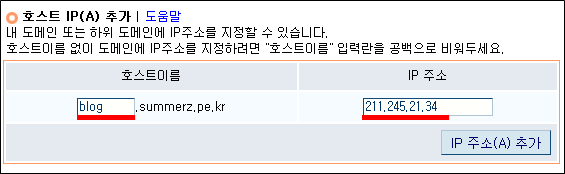
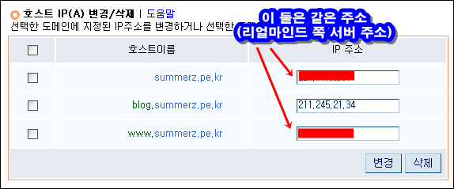
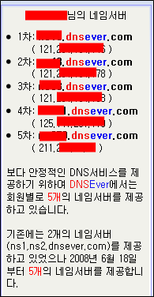
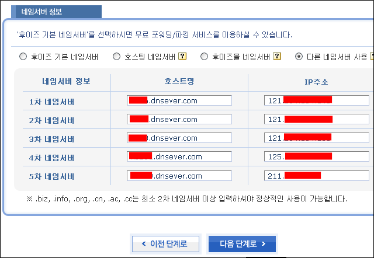

태터툴즈 클래식에서 텍스트큐브닷컴으로 이사를 온 김에 혹시나마 다른 분들에게 도움이 될까 싶어 간단하게(?) 이사記를 적습니다. 편의상 존댓말은 생략하였습니다.  

<!-- truncate -->

최초 상태  

* 기존

+ [태터툴즈 클래식 (Official Release)](http://retro.tattertools.com/classic/) 사용 중
+ 블로그 주소는 http://summerz.pe.kr/blog/
+ www 를 붙여서 http://www.summerz.pe.kr/blog/ 라고 해도 접속 가능
+ 도메인은 [후이즈](http://whoisdomain.kr/), 계정은 [리얼마인드](http://www.realmind.net/)에 있다.

* 원하는 상태

+ [텍스트큐브닷컴](http://www.textcube.com/)으로 이전
+ 새로운 블로그의 주소는 http://blog.summerz.pe.kr/
+ 주소체계가 바뀌어도 퍼머링크는 유지
+ 블로그는 옮겨도 계정의 나머지는 다른 용도로 계속 사용할 예정

  

1. [태터툴즈 & 텍스트큐브 도움말 위키](http://help.tattertools.com/ko/)에 있는 [migrator.zip](http://help.tattertools.com/ko/Migration#0.96.2C_.ED.81.B4.EB.9E.98.EC.8B.9D.280.971.29_.EC.82.AC.EC.9A.A9.EC.9E.90_.EA.B0.88.EC.95.84.ED.83.80.EA.B8.B0_.EB.B0.A9.EB.B2.95) 를 다운로드 받았다.

  

2. 다운받은 압축을 풀면 나오는 migrator.php 를 태터툴즈 클래식이 설치된 계정의 admin admin 디렉토리에 설치 (ftp로 업로드)를 했다. (실제 내 경우에는 ftp 프로그램을 사용해 /blog/admin/ 에 업로드를 했다)

  

3. 설치 후 /blog/admin/migrator.php 를 실행시켰더니 아래와 같은 화면이 나왔다. (내 경우에는 주소창에 http://summerz.pe.kr/blog/admin/migrator.php 를 넣고 엔터)  
  

  

4. 화면 제일 아래에 있는 이주 데이터 다운로드를 클릭하니 xml 파일을 다운로드 받으라고 해서 다운로드 받았다. (내 경우에는 파일명이 Tattertools-Migration-20080629.xml 이었다.)

  

5. 텍스트큐브닷컴에 로그인을 하여 환경설정 -> 데이터관리 -> 복원하기를 선택했다. 위의 .xml 파일이 30MB 이하면 바로 업로드도 가능하지만 내 경우에는 100MB 가 넘는 관계로 내 계정에 ftp 로 업로드를 시키고, URL을 입력했다.  
  

  

6. 한참 시간이 지나면 백업이 완료되었다는 문구가 나오고 실제로 태터툴즈 클래식에 있던 모든 글이 텍스트큐브닷컴으로 이전이 됨을 확인할 수 있었다.

  

7. 텍스트큐브닷컴의 주소는 http://summerz.textcube.com 으로 정했으며, 2차 도메인을 사용하기로 하였다. 2차 도메인은 http://blog.summerz.pe.kr/ 로 하기로 결정하고 관리자 페이지의 환결설정 -> 블로그 -> 블로그 주소 설정에 아래와 같이 주소를 입력하고 설정값을 저장하였다.  
  

  

8. 현재 후이즈의 내 도메인 summerz.pe.kr 은 모두 현재 호스팅 중인 리얼마인드의 네임서버를 사용하고 있기 때문에, 텍스트큐브로 연결할 방법이 없었다. 그래서, 무료 DNS 서비스인 [DNSEver](http://kr.dnsever.com/)를 사용하기로 결정하였다.

  
  

9. DNSEver 에 접속하여 로그인 한 후 좌측 메뉴에서 도메인 추가를 선택하여 도메인명을 입력하였다. (내 도메인인 summerz.pe.kr 을 입력했다.)  
  

  

10. 도메인 추가 후 호스트 IP(A) 관리 링크를 선택해서 원하는 주소를 입력한다. (내 경우에는 blog 라는 서브도메인을 사용하기로 하였으니 blog 를 입력했고, summerz.textcube.com 의 ip 주소를 ping으로 찾아서 입력했다.)  
  

  

11. 그리고, 기존 계정에 있던 정보는 그대로 사용을 해야 하니 기존 계정으로의 연결을 위해 www 부분도 입력을 했다. 입력을 모두 하고 나니 아래와 같이 정리가 되었다.  
  
(결국 blog.summerz.pe.kr 은 텍스트큐브닷컴 서버로 연결시키고, summerz.pe.kr 과 www.summerz.pe.kr 은 기존의 리얼마인드 계정로 연결시킨 것이다.)  
  

  

12. 내 도메인을 등록한 후이즈에 가서 네임서버 정보를 DNSEver 쪽의 주소로 변경을 하면 된다. 참고로 DNSEver의 네임서버는 사용자당 총 5개씩 지원을 했다.  
  

  

13. 후이즈로 가서 summerz.pe.kr 에 연결된 네임서버를 모두 아래와 같이 DNSEver 의 네임서버로 변경하였다.  
  

  

14. 기존 주소인 http://summerz.pe.kr/blog/ 은 여러 블로그 및 검색엔진에 링크가 걸려있기 때문에 http://blog.summerz.pe.kr 로 바꾼다면 기존 링크들이 깨지게 된다. 그래서, 간단한 방법으로 리다이렉팅을 하기로 했다.  
  
태터툴즈 클래식은 포스트를 구분하는 방법으로 pl 변수를 사용했다. 예를 들면 http://blog.summerz.pe.kr/index.php?pl=113 이런 식으로 말이다.  
  
텍스트큐브닷컴의 경우 단순히 뒤에 포스트의 번호만 다는 방식으로 포스트 구분을 하고 있지만 과거 버전과의 호환성을 유지하기 위해서 여전히 index.php?pl=113 같은 방식을 지원하고 있었다.  
  
그래서 아래와 같은 코드를 만들어서 (www.)summerz.pe.kr/blog/index.php?pl=xxx 로 오는 방문객을 blog.summerz.pe.kr/index.php?pl=xxx 로 리다이렉팅 시키도록 기존 태터툴즈 클래식의 index.php 최상단에 코딩했다. (참고: 발로 짠 소스임 -\_-)  
  

<?  
$get\_uri = $\_SERVER['HTTP\_HOST'] . $\_SERVER['PHP\_SELF'];  
if($\_GET['pl'])        $get\_pl = '?pl=' . $\_GET['pl'];  
else                $get\_pl = '';  
  
if(eregi('www.summerz.pe.kr/blog/', $get\_uri)){  
    // www.summerz.pe.kr/blog/ 로 들어온 경우  
    $get\_uri = str\_replace('www.summerz.pe.kr/blog/', 'blog.summerz.pe.kr/', $get\_uri);  
    if(!$get\_pl)    $get\_uri = str\_replace('index.php', '', $get\_uri);  
    else            $get\_uri = $get\_uri . $get\_pl;  
}else{  
    // summerz.pe.kr/blog/ 로 들어온 경우  
    $get\_uri = str\_replace('summerz.pe.kr/blog/', 'blog.summerz.pe.kr/', $get\_uri);  
    if(!$get\_pl)    $get\_uri = str\_replace('index.php', '', $get\_uri);  
    else            $get\_uri = $get\_uri . $get\_pl;  
}  
  
header("Location: http://$get\_uri");  
exit;  
?>  

  

완료 상태  

* 태터툴즈 클래식의 모든 글들이 텍스트큐브닷컴으로 성공적으로 이전

+ 단, 필요에 의해 사이즈를 임의대로 줄인 이미지들의 경우 img 태그 안에 width 만 입력하고 height 는 생략한 것들은 height가 자동으로 설정되었는지 비율이 맞지 않음

* 텍스트큐브닷컴이 index.php?pl=xxx 라는 하위 호환성을 유지해줌으로써 임시로나마 과거 포스트들의 퍼머링크를 유지할 수가 있게 됨

+ 검색어 관련 (stext) 등의 정보는 파악하지 않고, 우선 포스트 번호 (pl)만 적용된 상태
+ 검색엔진들이 새로운 주소로 리다이렉션되는 부분을 반영할 수 있는지 궁금

* 자료실 및 블로그 외의 정보들은 여전히 예전 호스팅 계정에서 사용 가능

+ 예1) 영화대본 자료실 http://summerz.pe.kr/smallpds/

  
여기까지입니다. :)  
  
대부분 이런 데이터 이전 작업을 하다보면 꼭 한 두 가지 이상씩 뜻하지 않는 오류가 발생하곤 하는데, 이번 이사는 정말 깨끗하게 한방에 - 데이터 호환성부터 네임서버 세팅까지 - 해결되었습니다. (와우!)  
  
태터툴즈 클래식에 정이 많이 들었지만, 이사일지까지 쓴 이상 예전 기억은 마음 속에 묻어두고 새로운 집에 정을 들여야겠습니다.
