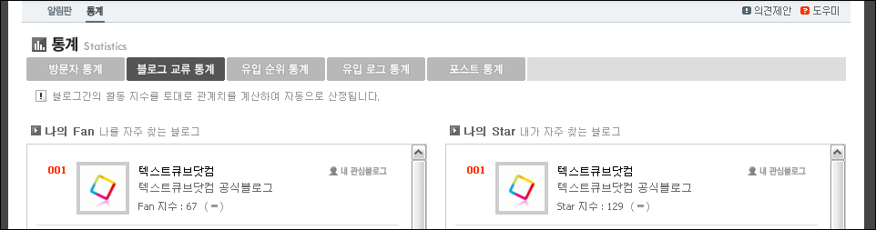

<!-- truncate -->

  
현재 [텍스트큐브닷컴](http://textcube.com/)의 관리자 페이지로 로그인해서 센터의 통계 메뉴를 보면 블로그 교류 통계라는 것이 있습니다. 나의 Fan과 나의 Star 라는 두 개의 리스트가 보이는데요, 쉽게 말해서   
  
텍스트큐브 블로그를 가진 상대가 (로그인한 상태에서) 내 블로그에 많이 접속한 접속을 포함 여러 요소가 반영된 순서대로 나의 Star에 리스팅이 되고, 반대로 내가 (로그인한 상태에서) 많이 접속한 접속을 포함한 여러 요소가 반영된 텍스트큐브 블로그들이 순서대로 나의 Fan에 리스팅이 되는 듯 합니다.  
  
제게 팬시한 감이 없어서 그런지 개념이 조금 낯뜨겁다는 생각이 잠깐 들더군요. 원래 관계라는 게 자주 왕래하고, 자주 표현해야 단단해진다는 건 알고 있지만 지수가 숫자로 나오니 저게 방문수인가 싶은 생각도 들고, Fan과 Star가 나란히 정렬된 모습이 조금은 액션 (관심블로그 등록)을 강요하는 UI 가 아닌가 싶기도 했고요.  
  
조금만(^^) 더 세련되지면 좋지 않을까 하는 생각입니다. ^^
