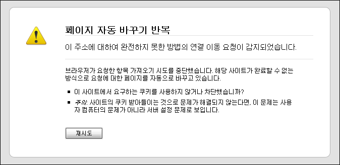

<!-- truncate -->

  
파이어폭스 3.0 ( + 윈도 XP sp3) 를 사용하고 있습니다.  
  
텍스트큐브닷컴의 도메인을 개인 도메인 사용으로 해서 사용하고 있는데, 로그인하려고 하면 위와 같은 메시지가 표시되면서 진입이 되지 않습니다.  
  
도메인을 텍스트큐브닷컴 쪽으로 돌려서 로그인을 시도하면 로그인이 됩니다.  
  

blog.summerz.pe.kr 에서 로그인 -> 안됨 (X)  
summerz.textcube.com 에서 로그인 -> 잘됨 (O)

  
잘 될 때는 잘 되는데, 안 될 때는 저렇게 되더라고요.  
  
왜 그런 걸까요. -\_-;
