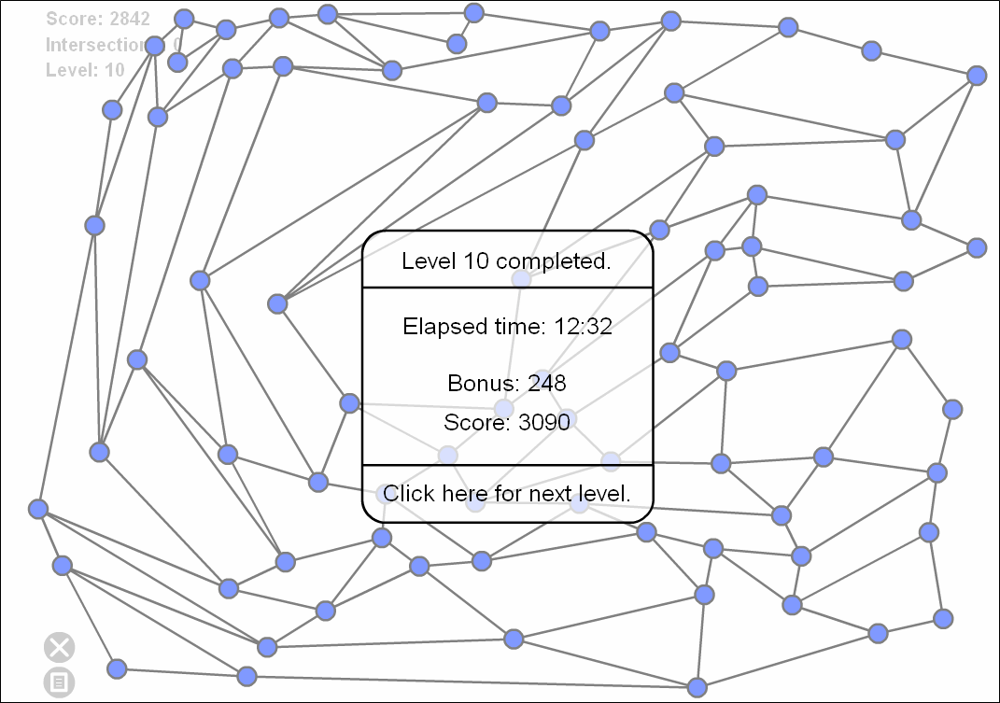

다급하게 생각해봐야 나만 손해.  

<!-- truncate -->

아무리 꼬여도 모든 일은 결국에는 풀리기 마련.  
  
그러니,  
  
차근차근 생각하자.  
  

  
내가 푼 planarity puzzle 은 멘사 코리아 게시판에 올려진 [플래시 파일](http://www.mensakorea.org/bbs/data/quiz/PlanarityExperimental.swf)  
  
구글에서 검색되는 것은 [planarity.net 의 800 x 600 크기의 플래시](http://www.planarity.net/game.php)
