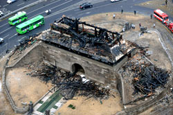
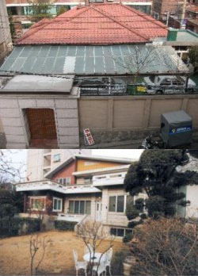

<!-- truncate -->

숭례문이 탔으니 이를 어째.  
음... 그래, 문화재 하나 새로 만들면 되겠지.

  

음... 뭐가 좋을까?  
그래, 故 박정희 어르신과 故 최규하 어르신의 집을 문화재로 등록하면 되겠다.  
뭐, 생가도 아니지만, 어때.

  
  

관련 링크  
  
[문화일보 - 박정희·최규하 前대통령 가옥, 문화재 된다](http://www.segye.com/Articles/Punch/Quick/Article.asp?aid=20080807001572&subctg1=00&subctg2=00)
