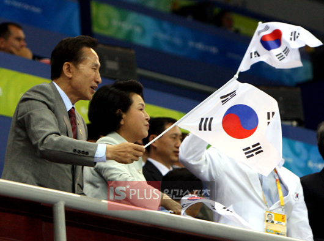
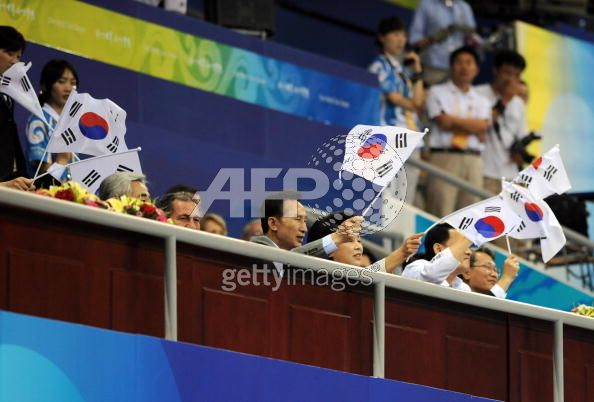
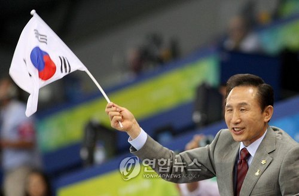

> 국기를 거꾸로 꽂는 것은 국제적으로 한 국가에 ‘심각한 생명위협이나 물자 고갈
> 위협이 찾아와 원조가 필요하다’는 것을 의미합니다.  
>
> [출처 : 희망지성 국제방송](http://soundofhope.or.kr/bbs/zboard.php?id=hot&no=604)
>
>   
> Distress – flying the flag upside-down, or tying it into a wheft  
>
> [출처 : 위키피디아 (Flag terminology)](http://en.wikipedia.org/wiki/Flag_terminology)

<!-- truncate -->

  

  

  

  
구해줘요. 흑흑.  
Help us. (a cry for help)  
  
  
저 새낀 정말...  
  
  
  

관련 링크  
  
[희망지성 국제방송 - 개막식 쓰촨 소년, 뒤집힌 국기 들어 화제](http://soundofhope.or.kr/bbs/zboard.php?id=hot&no=604)  
[연합뉴스 - <올림픽> 조직위, 한국 선수이름 '맘대로 표기'](http://app.yonhapnews.co.kr/YNA/Basic/article/search/YIBW_showSearchArticle.aspx?contents_id=AKR20080809066500007)  
[YTN - 미 쇠고기 O157 리콜...한국 수출 작업장 제품 (via 엠군)](http://www.mgoon.com/view.htm?id=1598605)
