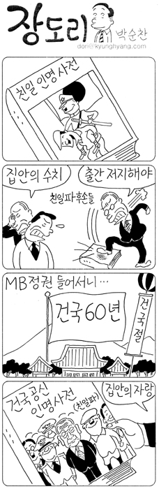

> 인간은 '놀이'하는 존재다. 하여 에코는 스포츠 자체를 부인하진 않는다. 대신 이렇게 묻는다. 만약 당신 주위에 섹스는 하지
> 않으면서, 다른 사람이 하는 섹스를 구경하기 위해 일주일에 한번씩 암스테르담(사창가)에 가는 사람이 있다면 과연 정상이라 할 수
> 있겠는가? 우리는 그런 사람을 '관음증 환자'라고 부른다.  
>   
> 마찬가지로 자신의 신체를 사용한 '놀이(운동)'는 전혀 하지 않으면서, 스포츠 관람에만 넋을 빼는 사람이 있다면 그 역시 똑같은 환자다.  
>   
> 출처 : [장정일의 독서일기 (노컷뉴스) - 스포츠 잡담가와 관음증 환자](http://www.cbs.co.kr/nocut/show.asp?idx=905129)

<!-- truncate -->

  

대놓고 친일파에게 지분을 주려는 건지 어떤건지 이해를 할 수 없는 [광복절의 건국절 타령이니 뭐니 하는 소란](http://www.ytn.co.kr/_ln/0101_200808151835488067)이나, 이제는 거리낌없이 [아무에게나 쏴질러대는](http://blog.daum.net/brightston/6185336) [색소 섞인 물대포](http://www.hani.co.kr/arti/society/society_general/304612.html), 예전 같으면 시끄러웠을 [영부인 언니 게이트](http://www.pressian.com/Scripts/section/article.asp?article_num=60080815130406)의 얼렁뚱땅 종결, [한나라당 서울시의회 의장의 부패](http://www.mediatoday.co.kr/news/articleView.html?idxno=70717) 소식,  역시 [한나라당 상임고문의 불법 군납청탁으로 인한 구속](http://www.cbs.co.kr/nocut/show.asp?idx=904837) 소식이 올림픽 때문에 모두 조용해졌죠.  
  
[공중파 3사가 모두 금메달이 걸린 한 종목의 중계만 보여준다](http://jamja.tistory.com/764)든지, 이번 기회에 실추된 기업 이미지를 올리기 위해 [Don't Stop Me Now](http://kr.youtube.com/watch?v=58CJih1iYC0)와 [I Was Born To Love You](http://kr.youtube.com/watch?v=jiot1P3-Hng)를 팔아 열심히 광고를 해대는 기업들의 난리를 보면 이중으로 답답해지죠.  
  
2008년 북경 올림픽 기간 동안 가장 많은 혜택을 본 사람들이 2mb를 비롯한 정치인들과 몇몇 경제인들이라는 것은 잘 알겠지만, 그래도 위와 같은 비유는 좀 아니지 않나 싶어요. [직접 하지 않으면 말을 말어](http://news.d.paran.com/snews/newsview.php?dirnews=1912131&year=2008) 수준이잖아요.  
  
동네 조기축구회에도 한 번 안나가지만 일년 내내 축구장을 찾는 팬도 있을 것이고, 평생 일기 한 번 쓰지 않지만 일년 내내 책을 읽는 독서광들도 있을 것인데, 직접 하지 않고 구경하면 관음증 환자라는 논리가 조금 불편해요.  
  
저는 올림픽에 그리 열광하지도 않고, 장정일 소설가의 맥락도 이해가 가긴 가지만 저 말은 왠지 타겟이 개인에게 있는 것 같아요. 그런 의미에서 인용한 부분의 마지막 단락을 이렇게 바꾸고 싶어요.  
  
> 마찬가지로 자신이 해야만 하는 '행위(의무)'는 전혀 하지 않으면서, 스포츠 관람 (볼거리)에만 넋을 빼게 만드는 기업/미디어가 있다면 그 역시 똑같은 환자다.
