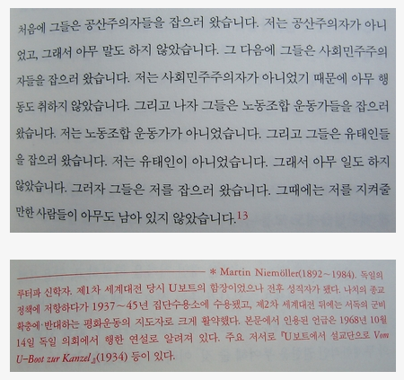

2008.8.30. 버락 오바마 대통령 후보 수락 연설 (동영상, 영어)  
America, we are better than these last eight years. We are a better country than this. 라는 문장을 들으니, Korea, we were better ten years ago than these days. We were a better country than now. 라고 하고 싶다. ㅠ.ㅠ  
[▶ 보러가기](http://elections.nytimes.com/2008/president/conventions/videos/20080828_OBAMA_SPEECH.html)  

<!-- truncate -->

※ 연설도 연설이지만 뉴욕타임즈의 연설 보여주는 UI 가 참 멋지다. :)

  

2008.8.29. 보안성이 뛰어난 USB 플래시 드라이브  
패스워드 10회 오류시 제품의 모든 내용이 삭제되며, 암호화칩이 파괴됩니다. 이 경우 IRONKEY의 재사용이 불가능하며, AS가 되지 않습니다. 연속 10회이며, 예를 들어 9회째에 암호를 정확히 입력하고 암호를 재설정하면 다시 0회로 카운트됩니다. 첩보영화에 나오는 수준의 보안이 아닌가 싶다. 요긴하게 사용할 분들 계실 듯.  
[▶ 보러가기](http://www.funshop.co.kr/vs/detail.aspx?categoryno=340&itemno=5765)

  

2008.8.28. DSLR에 동영상 촬영이 웬말이냐!  
이제 DSLR 하나만 있으면 스틸사진부터 동영상까지 해결된다. 보급기 유저의 입장에서는 상당한 메리트다. / 게다가 콤팩트디카의 동영상기능과는 비교할 수 없다. 화질부터 수준이 다르고, 무엇보다 렌즈를 교환할 수 있고 수동 포커싱과 심도조절이 가능하다는 점은 더이상 말이 필요없게 한다. 단점이라면 동영상 촬영 시간의 제한과 동영상 촬영시 포커스가 AF는 안되고 MF 만 된다는 것. 하지만, [사이트](http://chsvimg.nikon.com/products/imaging/lineup/d90/en/d-movie/)에 가서 영상을 보면 그 정도 단점이야... 하는 생각이 절로 든다. 지름신 영접하실 분들 정말 많을 듯.  
[▶ 보러가기](http://communi21.tistory.com/384)  
[▶ D90 | D-MOVIE - a new shooting function](http://chsvimg.nikon.com/products/imaging/lineup/d90/en/d-movie/)

  

2008.8.27. 아무도 남아 있지 않았습니다
  

[불복종의 이유]에서 재인용, 하워드 진/앤소니 아르노브 , 이재원 옮김, 이후, 2003  
  
나도 누가 한 말인지 몰랐는데, delius님 덕분에 이제야 알았다.  
  
[▶ 보러가기](http://delius.egloos.com/3021087)

  

2008.8.26. 영감을 주는 또는 특이한 또는 재미있는 이미지들
  
재밌는 이미지들이 많습니다. 저런 이미지를 촬영, 제작하는 분들, 정말 대단한 분들이예요.   
[▶ 보러가기](http://i-dreaming.com/2511584)

  

2008.8.25. 어쿠스틱 뉴스 다시 시작.
  
예. 가내수공업 방식으로 일일이 손으로 꾸며서 내놓고 있습니다. 근데, 미투데이 포스팅들과 겹쳐서 정신이 없을 것도 같군요. 어쨌든 시작입니다. :)
