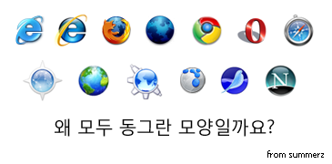

<!-- truncate -->

  
이번에 구글에서 새 웹 브라우저 [크롬 (Chrome)](http://www.google.com/chrome)을 내놓았는데, 써보니까 빠르긴 빠르더군요. 특히 초기 구동 속도가 장난 아니예요. 파이어폭스나 오페라처럼 추가 기능들이 붙어 나오기 시작하면 많은 사람들에게 인기를 얻을 것 같더군요.  물론 [구글의 기억력이 무섭다고 느껴지면](http://blographic.net/entry/837) 쉽게 쓰지는 못할 것 같기도 하지만 말이죠.  
  
그나저나 왜 웹 브라우저 아이콘들은 하나 같이 동그란 모양일까요? 많이 알려진 웹 브라우저들의 아이콘을 몇 개 모아봤는데 전부 동그랗더군요.  
  
제 추측으로는 World Wide Web 을 돌아다니는 도구이기 때문에 사용자로 하여금 지구의 동그란 모양을 상징하는 모양을 떠올리게 만들려고 그러는 게 아닌가 싶었어요. (사파리나 시몽키 등은 조금 다른 경우이긴 하지만 말이죠)  
  
혹시 왜 그런지 아시는 분 계신가요? ^^  
  
  

왼쪽 상단부터 시계방향으로 순서대로  
  
[인터넷 익스플로러 6](http://ko.wikipedia.org/wiki/%EC%9D%B8%ED%84%B0%EB%84%B7_%EC%9D%B5%EC%8A%A4%ED%94%8C%EB%A1%9C%EB%9F%AC_6#.EB.B2.84.EC.A0.84_6), [인터넷 익스플로러 7](http://ko.wikipedia.org/wiki/%EC%9D%B8%ED%84%B0%EB%84%B7_%EC%9D%B5%EC%8A%A4%ED%94%8C%EB%A1%9C%EB%9F%AC_6#.EB.B2.84.EC.A0.84_7), [파이어폭스](http://ko.wikipedia.org/wiki/%ED%8C%8C%EC%9D%B4%EC%96%B4%ED%8F%AD%EC%8A%A4), [그란 파라다이소](http://www.mozilla.org/projects/firefox/3.0a1/releasenotes/), [크롬](http://ko.wikipedia.org/wiki/%EA%B5%AC%EA%B8%80_%ED%81%AC%EB%A1%AC), [오페라](http://ko.wikipedia.org/wiki/%EC%98%A4%ED%8E%98%EB%9D%BC_%28%EC%9B%B9_%EB%B8%8C%EB%9D%BC%EC%9A%B0%EC%A0%80%29), [사파리](http://ko.wikipedia.org/wiki/%EC%82%AC%ED%8C%8C%EB%A6%AC_%28%EC%9B%B9_%EB%B8%8C%EB%9D%BC%EC%9A%B0%EC%A0%80%29), [넷스케이프 네비게이터](http://ko.wikipedia.org/wiki/%EB%84%B7%EC%8A%A4%EC%BC%80%EC%9D%B4%ED%94%84_%EB%82%B4%EB%B9%84%EA%B2%8C%EC%9D%B4%ED%84%B0), [시몽키](http://ko.wikipedia.org/wiki/%EC%8B%9C%EB%AA%BD%ED%82%A4), [플록](http://ko.wikipedia.org/wiki/%ED%94%8C%EB%A1%9D), [컨커러](http://ko.wikipedia.org/wiki/%EC%BB%A8%EC%BB%A4%EB%9F%AC), [옴니웹](http://www.omnigroup.com/applications/omniweb/), [카미노](http://ko.wikipedia.org/wiki/%EC%B9%B4%EB%AF%B8%EB%85%B8)
