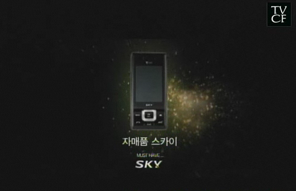

음악과 함께 전지현이 등장합니다. 춤을 추는데 나오는 일부가 가려진 문장이 나옵니다.  

<!-- truncate -->

영혼을 팝니다  
천육백만(원)  
살아 움직이는  
바디

  
그러니까, 전지현의 영혼을 파는데 가격은 천육백만원. 살아 움직이는 바디는 덤이라는 거겠죠. 주의할 점은 우리는 영혼 (소울)을 사는 것일 뿐, 살아 움직이는 (전지현의 매력적인) 바디는 덤으로 얻을 수 있다는 것입니다.  
  
물론 실제로는 전지현(과 그녀의 육감적인 몸매 혹은 영혼)의 가격에 대한 이야기가 아니라 소울폰의 기능에 대한 얘기죠. 역시 광고에서 잘 먹힌다는 [3B 전략](http://703scols.tistory.com/754) 중의 하나겠죠.  
  

이미지를 클릭하면 광고를 보실 수 있는 링크로 연결됩니다.

  

이미지를 클릭하면 광고를 보실 수 있는 링크로 연결됩니다.

  
  
  
비슷한 컨셉의 광고가 있는데요, 바로 자매품 스카이 시리즈입니다. 퇴근압박 시계, 오무려 집게, 영화까지 패러디한 정말 잘 찢어지는 스카이 헐크 셔츠와 정말 대충대충 깎이는 스카이 카리스마 면도기까지 별의별 제품을 광고하면서 제일 끝에 자매품을 잊지 않고 광고합니다. 물론 자매품은 스카이 핸드폰들이죠.  
  
역시나 중요한 점은 스카이 핸드폰을 부각시키려는 의도는 숨기고, 자매품 정도로 파는 겁니다. 스카이 제품은 이제 이미지 광고도 필요없다는 걸까요? 혹은 부담없는 생활 속의 제품? 하긴, 요즘에는 어떻게든 이슈가 되는 것만으로도 돈이 되는 세상이니까요. 가수들이 버라이어티 프로그램에 나와서 웃기기 시작한지가 몇 년인데요.  
  

이미지를 클릭하면 광고를 보실 수 있는 링크로 연결됩니다.

  
  
  
  
제품의 기능을 알기 쉽게 설명하는 게 원래 광고의 목적이라고 한다면, 언젠가부터 오리네 광고들은 대부분 연예인들을 앞세워 이미지(로 대표되는 허영심)만을 팔기 시작하더니, 이제는 그마저도 히히덕 거리며 공갈을 내세우는군요.  
  
유머감각이나 재치에 대해서 불만이 있는 건 아니예요. 다만 그게 제품과 무슨 관계가 있느냐는 거죠. 정말 삼성 소울폰으로부터 뭔가 소울 (soul)을 느낄 수 있는 걸까요? 스카이 핸드폰이 퇴근압박을 해주고, 지하철 예절을 지키는데 도움이 되는 걸까요? 한번 피식 하면서 보는 광고에 결국 소비자들의 주머니가 가벼워 진다는 사실이 불만이라는 거예요.  
  

링크  
  
[▶오무려 집게 (자매품 스카이M) 광고 보기](http://blog.naver.com/0511190/60052765989)  
[▶퇴근압박 시계 (자매품 스카이 블레이드) 광고 보기](http://tvpot.daum.net/clip/ClipViewByVid.do?vid=WnJX1UasFaY$)  
[▶파이낸셜 뉴스 - ‘자매품 스카이’ 광고 대박..팬택 싱글벙글](http://www.fnnews.com/view?ra=Sent0701m_View&corp=fnnews&arcid=080812215702&cDateYear=2008&cDateMonth=08&cDateDay=13)  
[▶씨네21 - [포커스] 영화-CF 공동 마케팅 시대](http://www.cine21.com/Article/article_view.php?mm=001002003&article_id=52365)
