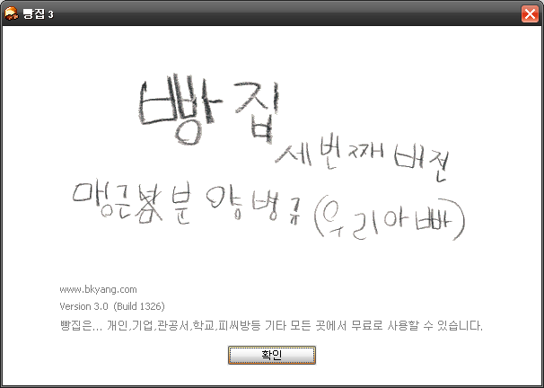

오래 전부터 양병규님이 만드신 압축 프로그램 빵집의 열렬한 팬이었습니다.  

<!-- truncate -->

  
며칠 전에 빵집을 다운 받으려고 오래 전부터 외우고 있던 주소 bkyang.com 을 브라우저 주소창에 넣고 엔터를 쳤는데, 해외 쪽에서 도메인 파킹된 페이지가 열렸습니다.  
  
혹시 무슨 일이 있는 걸까요? 혹시 뭔가를 준비하시느라 닫아두신 거라면 괜찮은데요, 그런 게 아니라면 빵집의 팬으로서 심히 당황스럽습니다.  
  
아시는 분 계시는지요?  
  
  
2008년 9월 8일 현재, 지금은 잘 열립니다. :)
