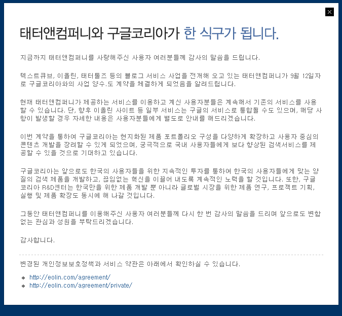

<!-- truncate -->

  
구글 코리아가 태터앤컴퍼니를 인수했다.  

SKT가 라이코스를 인수했을 때보다

네이버가 첫눈을 인수했을 때보다

다음이 티스토리를 인수했을 때보다

훨.씬.더.놀.랍.다.

링크

[TNC 블로그 - 태터앤컴퍼니, 이제 Google 과 함께 합니다.](http://blog.tnccompany.com/292)

[Google 한국 블로그 - 구글과 태터앤컴퍼니가 한 식구가 됩니다.](http://googlekoreablog.blogspot.com/2008/09/blog-post_12.html)

[텍스트큐브닷컴 공식 블로그 - 태터앤컴퍼니, 이제 Google 과 함께 합니다.](http://blog.textcube.com/48)

p.s. 개인적으로 [TNF](http://forum.tattersite.com/ko/) 분들의 반응 및 의견이 궁금하다.
