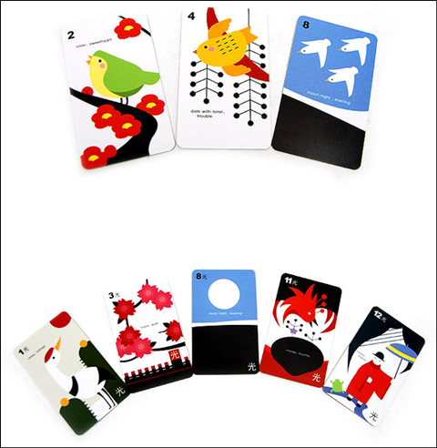

2008.9.8. LG는 참 잘했어요. 삼성은 별로!!  
이유는 LG는 타임 스퀘어 중간 쯤에 위치해 있지만 삼성은 한쪽 끝에 있습니다. 게다가 디지털 카메라의 한계 탓에 삼성 광고판은 특정 각도에서 찍지 않으면 날아가 버립니다. 왜? 혹시 밤에 네온사인 화려한 간판을 찍으면 날아가 버리는 경험을 하신 적이 있다면 이해가 쉬울 겁니다. 노출 조정을 세밀하게 하지 않으면 네온 간판은 특정 각도가 아닌 담에야 날아가 버리기 쉬워요. (자세한 카메라의 광학적 지식은 전문가가 아니라 패스합니다.) 더구나 LG 로고는 붉은 색 기반이라 어디서나 눈에 잘 띄지만 삼성 로고는 파란색인데 배경마저 흰색일 때가 많아서 흰색이 제일 먼저 날아가 버리고, 푸른 색도 연하게 보여집니다. 따라서 수백만장의 타임 스퀘어 광장 사진에서 삼성 로고가 또렷이 보이는 작품을 찾는 건 쉬운 일이 아닙니다. 삼성 임직원이 계시면, 지금 구글 이미지 검색에서 타임 스퀘어를 치시고, 삼성 로고가 뚜렷이 나온 사진을 찾아보세요. 의외로 찾기 힘들 겁니다. 디지털 (카메라)의 시대, 공유의 시대. 작은 센스가 큰 힘을 발휘할 수 있는 시대.  

<!-- truncate -->

[▶ 보러가기](http://eyeofboy.tistory.com/283)

  

2008.9.9. 선풍기 바람과 사망사고  
‘선풍기를 틀어놓고 자면 숨질 수가 있다’는 경고문을 박은 선풍기 회사를 본 적이 없고, 실제로 그 때문에 돈을 배상한 선풍기 회사가 없는 것으로 보아 가전회사들은 물론이고 피해 당사자조차 선풍기로 말미암은 죽음을 실제로는 믿지 않는 것 같다. ‘선풍기-죽음’이 사실이 아니라면 우리 언론들도 선풍기 죽음 사례를 별 생각 없이 보도함으로써 대중들의 잘못된 믿음을 증폭시키는 행위를 그만둬야지 않을까? 의사들 역시 선풍기 죽음을 정당화하는 대신 그게 진짜인지 밝혀줄 필요가 있다. 말 꺼낸 사람이 책임을 져야 하니, 내가 먼저 실험 대상이 되리라. 오늘 밤, 난 밀폐된 공간에서 선풍기를 틀고 잘 거다. 내가 다음에 칼럼을 쓸 수 있다면 ‘선풍기-죽음’은 미신이다. 최하지만 여전히 존재하는 선풍기 괴담. 서양에는 이런 게 없다는데, 도대체 어떤 연유로 생겨난 걸까?  
  
[▶ 보러가기 (죽지 않아)](http://www.hani.co.kr/arti/opinion/column/144730.html)

  

2008.9.11. 액티브X 대체기술 "있는데 안쓴다"  
하지만 금융기관 관계자는 "현재 인터넷익스플로러(IE)가 아닌 다른 브라우저 사용자들로부터의 수익과 대체 기술을 적용하는 비용을 고려했을 때 대체 기술 적용이 비용만 증가시킨다고 보고 있어 사용되지 않고 있다"고 말했다. 이와 함께 금융권이 보안시스템 개발ㆍ구축을 외주업체에 맡겨 정보와 기술력이 부족해 액티브X 문제에 능동적으로 대응하지 못하는 구조적인 시스템에 문제가 있다는 지적도 나오고 있다. 사실상 오픈웹 운동의 첫번째 시도는 실패로 돌아갔다. (물론 항소한다고 하니 꼭 성공했으면 좋겠다. 화이팅!!!) 복잡한 기술만 강요하고 정작 표준과 합리는 안드로메다로 내다 버린 금결원이 실망스러울 뿐이다.  
  
[▶ 왜 안쓸까 보러가기](http://www.dt.co.kr/contents.html?article_no=2008090502010760739002)  
  
[▶ 오픈웹 - 오픈웹 소송 제1심 판결서](http://openweb.or.kr/?p=154)  
[▶ 전자신문 - 이니시스, 모든 브라우저에 통하는 결제시스템 출시](http://www.etnews.co.kr/news/detail.html?id=200808210169)  
[▶ 디지털데일리 - [초점] e뱅킹 웹브라우저, 여전히 막강한 MS의 힘](http://www.ddaily.co.kr/news/news_view.php?uid=42045)

  

2008.9.13. 예쁜 화투 초보자도 "GO"  
어디 놀러가거나 여럿이 어울려 지내는 밤은, 게임을 즐기기 좋은 시간입니다. 보통 화투나 트럼프를 많이 하지만, 화투의 경우 월 표시가 없어서 입문자들은 지레 골치 아파하며 트럼프 쪽으로 돌아서는 경우가 많습니다. / 월표시도 있고 디자인도 트럼프처럼 세련된 것들이 있다면 공평한 밤이 될것 같습니다. 예쁘다. 다만 평을 보니 마감이 조금 아쉬운 품질인 듯.  
  

  
[▶ 보러가기](http://www.funshop.co.kr/vs/detail.aspx?categoryno=221&itemno=6232)

  

2008.9.14. 와이브로에 음성 실린다  
병원내에서는 와이브로를 통해 VoIP로 활용하고, PDA 기능 등을 활용해 원격진료 서비스까지 가능하게 만들 예정이다. 또 병원의 와이브로존을 벗어나는 곳에서는 일반 이동통신으로 자동 로밍되는 형태다. 이런 여세를 몰아 MVNO 사업자들이 힘을 내서 재밌는 단말기, 재밌는 서비스를 내야 할 때가 아닌가!  
  
[▶ 보러가기](http://www.etnews.co.kr/news/detail.html?id=200807240268)
