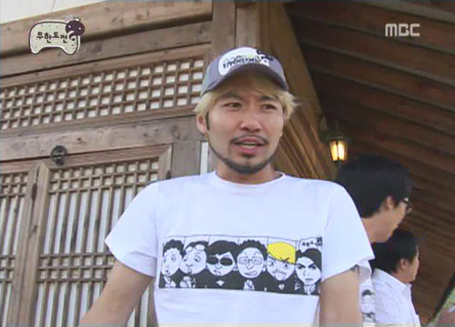
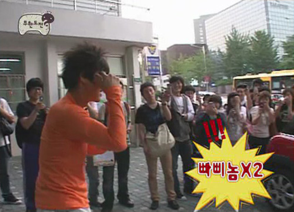
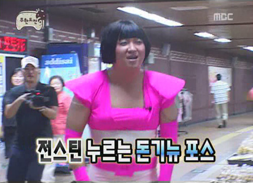

<!-- truncate -->

  
티 속의 캐릭터는 왼쪽부터 오른쪽 순으로 정준하, 정형돈, 유재석, 박명수, 노홍철, 전진입니다.  
  
돈을 갖고 튀어라 감독판에서도 살짝 '전진'을 고정 멤버로 확정하는 멘트가 나왔었는데, 하하 이후 제7의 멤버로 전진이 확실해졌음을 저렇게 티로 슬쩍 보여주는군요.  
  
그나저나 전진 미션 수행 때 구경하시던 시민이 '빠삐놈'이라고 외치던데... 대단합니다, 빠삐놈의 열풍!  
  

  
그러고 보니, 빠삐놈 전진과 디디디디아이에에에에에에씨오 정형돈이 만나는 장면이 있는데, 빠삐놈 병神디스코믹스 트리뷰트인가?  
  

  

관련링크  
  
[▶ 매거진t - tMAP 전진](http://www.magazinet.co.kr/Articles/article_view.php?mm=002004000&article_id=48592)  
[▶ 디시인사이드 무한도전 갤러리](http://gall.dcinside.com/list.php?id=muhan)  
[▶ 씨네21 - [편집장이 독자에게] 빠삐놈 신드롬](http://www.cine21.com/Article/article_view.php?mm=005003005&article_id=52624)  
[▶ 디제이늅 - 빠삐놈병神디스코믹스 (feat. 엄기뉴 전스틴 디제이쿠 이효리 한가인) (@디시인사이드 HIT 갤러리)](http://gall.dcinside.com/list.php?id=hit&no=6417&page=1&search_pos=-3569&k_type=0100&keyword=%EB%B9%A0%EC%82%90%EB%86%88)
