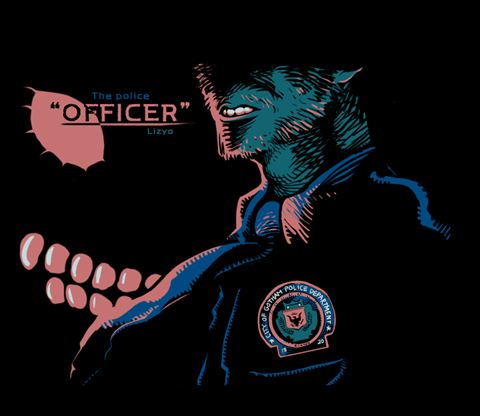

2008.9.20. Lizya님의 The Officer  

<!-- truncate -->

  
와- 배트맨 월드, 고담시의 새로운 세계관 탄생  
  
[▶ 보러가기](http://gall.dcinside.com/list.php?id=cartoon&no=200372&page=1&search_pos=-169214&k_type=1100&keyword=Lizya)

  

2008.9.19. 네이버의 모질라 파이어폭스 익스텐션 개발 뒷이야기  
전문을 변경없이 인용해달라는 권순선님의 요청에 따라 부분인용은 못하지만, 이러한 시도는 좋은 시도라고 본다. 가랑비에 옷 젖듯이, 천천히 천천히...  
  
[▶ 보러가기](http://kldp.org/node/97601)

  

2008.9.17. **스팸 전화번호 데이터베이스**  
일명 한번 울리고 끊기는 전화들, 의심되는 번호가 있으면 여기서 확인하면 된다. 멋진 협업 시스템.  
  
[▶ 확인하러 가기](http://www.missed-call.com/)

  

2008.9.16. 한국 애니메이션 주제가 모음 (디시인사이드 080824 업데이트)  
역시나 디시인들의 저력은 놀랍다.  
  
[▶ 들으러 가기](http://gall.dcinside.com/list.php?id=korea_ani&no=1104&page=1)

2008.9.15. 페이퍼 페이스 놀이 LP판 버전  
sleeve는 LP판이라는 뜻이다.  
  
[▶ 보러가기 (영어)](http://www.sleeveface.com/)
