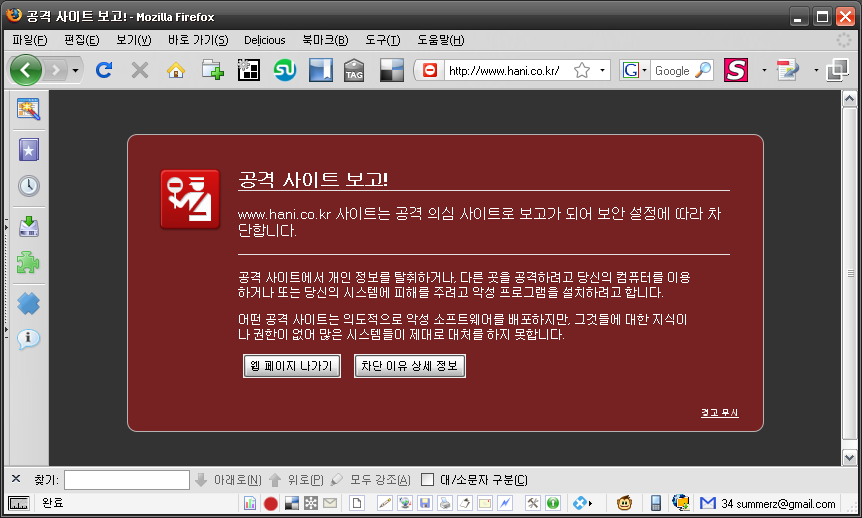

파이어폭스 3.0.4 로 한겨레 사이트를 들어갔더니 공격 의심 사이트로 분류되었다는 메시지가 나옵니다.  

<!-- truncate -->

  
흠. <http://hani.co.kr> 로 들어가면 잘 뜨는데, <http://www.hani.co.kr> 로 들어가면 저런 메시지가 뜹니다.  
  
현재 시각 2008년 12월 3일 11시 01분  
  

추가  
  
한겨레에 공지가 떴었군요.  
  
[악성코드로 인한 불편 사과드립니다](http://bbs.hani.co.kr/Board/ui_hani_alim/Contents.asp?STable=ui_hani_alim&RNo=138&Search=&Text=&GoToPage=1&Idx=139&Sorting=2)  
  
2008년 12월 3일 오전, 인터넷한겨레 사이트에서 악성코드가 발견되어 신고접수 후 30분내 상황을 처리하여 현재 악성코드는   
제거되어 정상적으로 서비스되고 있는 상태입니다.  
  
하지만 구글의 안전 브라우징으로 인해 구글 검색결과나 파이어폭스, 크롬 브라우저로 사이트에 방문하시는 이용자들에 한하여
인터넷한겨레 사이트가 차단되며 "경고: 이 사이트를 방문하는 것이 컴퓨터에 해를 줄 수 있습니다." 라는 문구와 함께 정상적으로
서비스를 이용하실 수 없는 경우가 발생하고 있습니다.   
  
안전 브라우징은 해당 문제가 해결되더라도 해제되기까지 약 하루정도의 시일이 필요하니, 구글 검색결과에서는 해당 URL을 복사하여
직접 주소창에 입력하거나 파이어폭스, 크롬 브라우저에서는 경고무시 기능을 사용하시면 되고 익스플로러 등 다른 브라우저로는 인터넷
한겨레를 원활히 사용할 수 있습니다.  
  
불편을 끼쳐드려 다시 한번 사과의 말씀 드리고 재발 방지를 위해 최선을 다하겠습니다.
  
  
게시일 : 2008-12-03 오후 5:35:32
